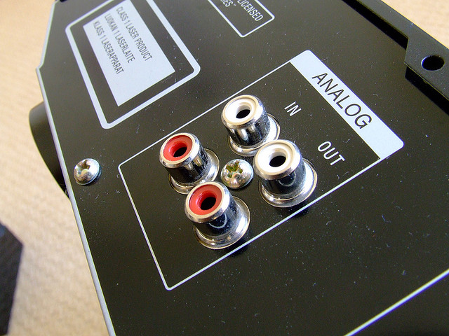
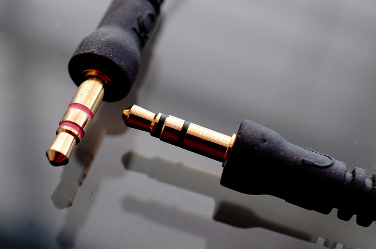
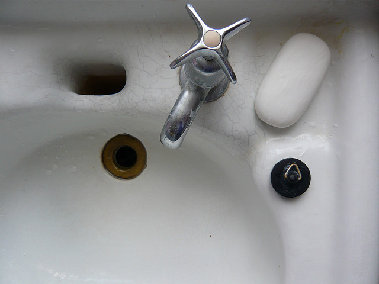
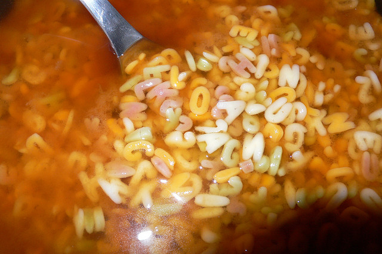
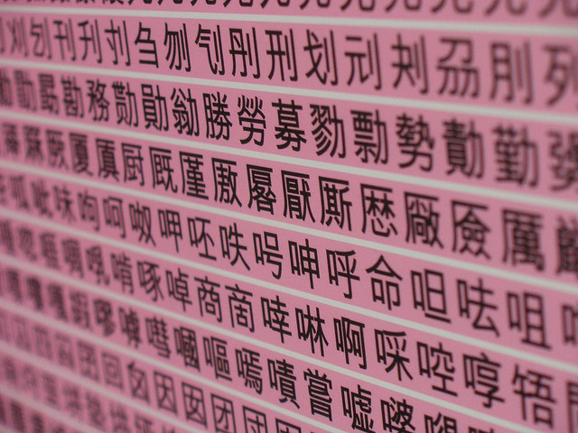
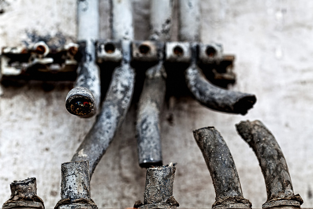

# Lecture 1: Introduction to Java IOs

## Table of Contents

1. [Objectives](#Objectives)
2. [Lecture](#Lecture)
   1. [A Univeral API](#UniversalAPI)
   2. [Sources, Sinks and Streams](#SourcesSinksAndStreams)
   3. [A Simple Example: File Duplicator](#FileDuplicator)
   4. [Binary- vs Character-Oriented IOs](#BinaryVsCharacterIOs)
   5. [The Mighty Filter Classes](#MightyFilterClasses)
   6. [Performance and Buffering](#PerformanceAndBuffering)
   7. [Shit Happens… Dealing with IO Exceptions](#ShitHappens)
3. [Resources](#Resources)
   1. [MUST read](#ResourcesMustRead)
   2. [Additional Resources](#ResourcesAdditional)
4. [What Should I Know For The Test And The Exam?](#Exam)


[](http://www.flickr.com/photos/bobbyzero/2300986336/)


## <a name="Objectives"></a>Objectives

The goal of this lecture is to give an **overview of IO programming in Java** and to see how classes in the `java.io` package can be used to read and write files. 

Why does it matter and why do we study that in this course?

* The first reason is simply that network programming ***is*** IO programming. A network program, whether it is a server or client, spends a lot of time reading and writing bytes. These bytes are encapsulated in IP packets and travel across the network. But as we will see later in the course, reading bytes from the network or reading bytes from a file is not really different. So, what we will learn in the first lecture will be very helpful when we start writing applications that use TCP or UDP via the Socket API.

* The second reason is that many network programs need to interact with the local file system. Have you ever thought about what happens when your web browser fetches a static html page? Well, the server on the other side opens a file, reads its content and sends it back to your browser. That shows that the web server is processing IOs in two ways (exchanging data with the file system and exchanging data with your browser). Again, what we will study in this first lecture will be useful later, for instance when we decide to implement our own HTTP server.

More specifically, here are the objectives of the lecture:

* Understand the concepts of **data sources**, **sinks** and **streams** and how they provide a foundation for standard IO classes. 

* Understand that these concepts are applied in the same way, whether you are reading data from files, from the network or from other processes running on your machine (what we later refer to as the **universal API**). 

* Understand the difference between **processing binary data** (bytes) and **processing text data** (characters). You should be able to decide when to use an `InputStream` or a `Reader`, and explain why. Be able to explain how **character encodings** work and how to deal with them in Java.

* Understand that it is possible to create **filter chains**, by wrapping `Writers` into `Writers` into `Writers` into `Writers` into `Writers`, with custom logic added at each level.

* Understand that the `BufferedReader`, `BufferedWriter`, `BufferedInputStream` and `BufferedOutputStream` classes use this mechanism. You should be able to explain how buffered IOs work and why they are important from a **performance** point of view.


**Note**: in this course, we only consider the **standard Java IO API**. For specific needs and in particular when writing scalable network servers, another API is available. This API has been named the New IO API, generally referred to as the NIO API.

## <a name="Lecture"></a>Lecture


### <a name="UniversalAPI"></a>1. A Universal API

[](http://www.flickr.com/photos/wikidave/7282386798/)

In any programming language, dealing with IOs means **dealing with an exchange of data**. This can mean different things, for example:

* you want to read configuration data from a **file**
* you want to write the result of a computation into a **file**
* you implement some kind of **server** and want to read data sent by **clients** over the **network**
* you implement some kind of **server** and want to send data back to the **clients**
* you want to write data, byte by byte, in a temporary **memory** zone
* you want to read data from this **memory** zone
* you have code executing on two **threads**; you want the code executing on the first thread to produce messages that are consumed by the code executing on the second thread.

Instead of having a different API, in other words different abstractions, classes and methods, for each of these situations, you can use the Java IO as a generic, universal API to solve all your data transfer needs. 

> At the end of the day, whether you are "talking" to a file, to a network endpoint or to a process does not matter. You are always doing the same thing: reading and/or writing bytes or characters. The Java IO API is the toolbox that you need for that purpose.


### <a name="SourcesSinksAndStreams"></a>2. Sources, Sinks and Streams

If you think about it, every situation where you need to deal with IOs can be described with 3 abstractions: 

* The first one is the concept of **source**, which is "something" that generates a sequence of bytes or characters. Again, it can be a file on the local file sytem, a client connected over the network or a process running on the local machine.

* The second one is the concept of **sink**, which "something" that can consume a sequence of bytes or characters. As before, it can be a file, a network endpoint or a process.

* The third one is the concept of **stream**, which you can think of as **a pipe that connects your program to either a source or a sink**. In the first case, it will be an input stream (that you can **read from**), in the second case, it will be an output stream (that you can **write to**). Note that the sources and the sinks are not connected directly. 

> The beauty of the Java IO API, and what makes it universal, is that once you have a stream, you always use it in the same way. Whether it is connected to a file source, a network source or a memoy source, you are using the same class and have access to the same methods. Similarly, if your stream is connected to a file sink, to a network sink or to a memory sink, you always write bytes to the stream in the same way.

#### 2.1. Reading Data From a Source

[](http://www.flickr.com/photos/chagiajose/5382140863/)

Concretely, when your program wants to read data from a source, it will:

1. **Get access to a source.** This will depend on the type of source you are using, but for instance you may use the `File` class to access a file in the local file system or the `Socket` class to access a network endpoint.

2.  **Open an input stream**, that will connect your program to the source. Typically, you will do that by either creating a new instance of a class like `FileInputStream` or by getting an existing instance by calling a method like `socket.getInputStream()`.

3. **Use the various `read()` methods from the `InputStream` class**, typically until the end of the stream is reached. The end of the stream is reached when the source has no more data to send (e.g. the entire file has been read) or when connection with the source has been lost (e.g. the network client has disconnected). 

4. **Close the stream**, by using the `close()` method defined in the `InputStream` class. 

#### 2.2. Writing Data To a Sink

[](http://www.flickr.com/photos/58271172@N00/3115329519/)

Similarly, when your program wants to write data from a source, it will:

1. **Get access to a sink.** This will depend on the type of source you are using, but for instance you may use the `File` class to access a file in the local file system or the `Socket` class to access a network endpoint.

2.  **Open an output stream**, that will connect your program to the sink. Typically, you will do that by either creating a new instance of a class like `FileOutputStream` or by getting an existing instance by calling a method like `socket.getOutputStream()`.

3. **Use the various `write()` methods from the `OutputStream` class**, until you don't have any more data to send. 

4. **Close the stream**, by using the `close()` method defined in the `OutputStream` class. 


#### 2.3. Design Your Code to Be Universal

When you design your own classes and methods, make sure that you keep the spirit of the Universal API. As a rule of thumb, **pass streams and not sources as method parameters**. Compare the following two methods:

```
/**
 * This interface will work only for data sources on the file system. In the
 * method implementation, I would need to create a FileInputStream from f and
 * read bytes from it.
 */
 public interface IPoorlyDesignedService {
  public void readAndProcessBinaryDataFromFile(File f);
}
```

```
/**
 * This interface is much better. The client using the service has a bit more
 * responsibility (and work). It is up to the client to select a data source
 * (which can still be a file, but can be something else). The method implementation
 * will ignore where it is reading bytes from. Nice for reuse, nice for testing.
 */
public interface INicelyDesignedService {
  public void readAndProcessBinaryData(InputStream is);
}
```


### <a name="FileDuplicator"></a>3. A Simple Example: The File Duplicator

To illustrate these basic concepts, let us consider a very simple example. The code below shows that we have implemented a class named `FileDuplicator`. Its responsibility should be easy to guess from his name. It provides a method that, when invoked by a client, copies the content of a file into another file.

Let us look at some elements of the code:

* We see that we use 4 classes from the `java.io` package. That is where you will find all standard interfaces and classes for doing simple and sophisticated tasks around IOs. **Spend some time to browse through the javadoc reference** (<http://docs.oracle.com/javase/7/docs/api/java/io/package-summary.html>). Being aware that some classes exist will prevent you from reinventing the wheel!

* The `File` class is not used directly for reading and writing data. It is used to do file system operations, such as checking whether a file with a specific name exists or not. In this example, it would not be stricly required (as an alternative, we could pass the file name directly to the `FileInputStream` and `FileOutputStream` constructors).

* The program is using two different streams, one connected to a source and the other connected to a sink. The `FileInputStream` and `FileOutputStream` classes are used to create these streams.

* Once the streams have been opened, the logic is very simple. We use a loop to consume all bytes, one by one, from the input stream. Each time that we read a byte, we write it immediately to the output stream. We can see that the `read()` method returns an int. This value is -1 if the end of the stream has been reached. Otherwise, it has a value between 0 and 255 (we are reading a single byte).

* Note that **this code is not very efficient and that copying large files would be painfully slow**. We will see later that is is much better to read/write blocks of bytes in a single read operation, or to use buffered streams.


```
package ch.heigvd.res.samples.io;

import java.io.File;
import java.io.FileInputStream;
import java.io.FileOutputStream;
import java.io.IOException;

/**
 *
 * @author Olivier Liechti
 */
public class FileDuplicator {
		
	public void duplicate(String inputFileName, String outputFileName) throws IOException {

	    // This is my data source
		File inputFile = new File(inputFileName);
		
		// This is my data sink
		File outputFile = new File(outputFileName);
		
		// These are 2 streams, 1 for reading and 1 for writing bytes
		FileInputStream fis = new FileInputStream(inputFile);
		FileOutputStream fos = new FileOutputStream(outputFile);
		
		int b;
		// I read all bytes from the input stream in a loop
		while ( (b = fis.read()) != -1 ) {
		    // I write each of the read bytes to the output stream
			fos.write(b);
		}
		
		// Important: when dealing with IOs, always close and clean-up resources
		fis.close();
		fos.close();
	}
	
}
```


### <a name="BinaryVsCharacterIOs"></a>4. Binary- vs Character-Oriented IOs

[](http://www.flickr.com/photos/dade_f/7110106731/)

If you browse through the [java.io](http://docs.oracle.com/javase/7/docs/api/java/io/package-summary.html) package, you will notice two parallel class hierarchies:

* On one hand, you will see a set of classes extending the `InputStream` and `OutputStream` abstract classes. These classes are used to read and write **binary data**. In other words, if you are writing an application that deals with images or sounds, then you will be happy to use these classes that will **process raw data**, **without doing any conversion**.

* On the other hand, you will see a set of classes extending the `Reader` and `Writer` abstract classes. These are used to read and write characters. In other words, if you are writing an application that deals with text data, then you will be happy to use these classes that will perform **conversions between raw data (bytes) and characters (in a particular encoding)**.

[](http://www.flickr.com/photos/bean/322616749/)

What does that mean? If you think about it, computers do not have a notion of character. They know about bytes, in other words about sequences of 8 bits. In order to manage text data, we have to agree on a particular **character encoding system**. The encoding system defines a correspondance between, on one hand, bit patterns and, on the other hand, characters. ASCII is a well-known character encoding system, which originally used 7 bits to represent characters. Here are a few examples for how bit patterns are mapped to characters in ASCII:

```
Binary value     Decimal value     Character
011 0110         54                '6'
100 0001         65                'A'
100 0010         66                'B'
…
110 0001         97                'a'
110 0010         98                'b'
```

**ASCII** worked well for many years, but there are many **languages with alphabets much larger than the latin alphabet**. For these languages, having only 7 bits (128 values) to represent characters is simply not enough. This is why several other character encoding systems have been developed over time. This has introduced quite a bit of complexity, especially when conversion from one encoding system to another is required.

In order to deal with internationalization, Java decided to use the **Unicode** standard to handle characters. When a Java program manipulates a character in memory, it uses **two bytes**. These two bytes are used to store what Unicode calls a **code point** (1'114'112 code points are defined in the range 0 to 10FFFF). A code point is a numeric value, which is often represented as `U+xxxxxx`, where `xxxxxx` is an hexadecimal value. What is useful (but also a bit confusing), is that the code points used to identify ASCII characters are the values defined in the ASCII encoding system. Huh? Take the character 'B' for instance. In ASCII, it is encoded with the decimal value 66. In Unicode, it has been decided that the code point `U+0042` (yes, 42 is the hexademical value of 66) would be used to identify the character 'B'.	

Unicode is actually not a character encoding system. When you have a code point, you still need to decide how you are going to encode it as a series of bits. Sure, you could use 16 bits (4 bits for each of the 4 hexadecimal values making up the code point) for each encoded character. But in general, that would be a waste. Think of a text written in english, with only latin characters. Since the code points of all characters are below 255, 

Sounds complicated? Well, it is a bit. Have a look at this [page](http://www.fileformat.info/info/unicode/char/42/index.htm). It will show you how the same character is represented in Unicode and in different encoding systems.

[](http://www.flickr.com/photos/svensson/40467662/)


### <a name="MightyFilterClasses"></a>5. The Mighty Filter Classes


[](http://www.flickr.com/photos/agfrg/4693609597/)

If you browse the `java.io` package, you will encounter 4 interesting classes: `FilterInputStream`, `FilterOutputStream`, `FilterReader` and `FilterWriter`. When you think about these classes, think about the **Decorator design pattern**. Think about **matriochkas** (poupées russes).

The role of these classes is to allow you to add behavior to a stream, in other words to do some processing on the bytes or characters being read or written. To illustrate this idea, let us consider an example:

* Let's imagine that **you hate the letter 'u'**. Each time that you work with a Writer, whether it is to write characters to a file or to send characters to a network server, you would like every occurrence of this letter to be **automatically removed from the stream**.
* While the logic is fairly simple (it is only a character comparison condition), **you don't want to repeat it over and over**. Also, you might one day realize that you love the letter 'u' but now hate the letter 'm'. That day, you don't want to have to go through all your codebase to reflect your change of heart and would like to **do the change in a single place**.
* The FilterWriter class is what you need to solve your problem. Here is what you would use it:
  * Firstly, you would create a class named `CensorshipWriter` that extends `FilterWriter`.
  * Secondly, you would override the various `write()` methods implemented by the `FilterWriter` class. This is where you would get rid of the the hated characters, before calling the `write()` method in the `super` class.

### <a name="PerformanceAndBuffering"></a>6. Performance and Buffering

[](http://www.flickr.com/photos/fireflite59/6129719816/)

In the Java IO, 4 classes use this filtering mechanism:

* For binary data, `BufferedInputStream` and `BufferedOutputStream` extend `FilterInputStream`, respectively `FilterOutputStream`.

* For character data, `BufferedReader` and `BufferedWriter` extend `FilterReader` and `FilterWriter`.

Why should you use these classes and what are they doing? Think about what is happening if you write a method that **consumes a binary stream connected to a file, byte by byte**. When you call the `read()` method, you are not really sure what is happening at a low level (because that is up to the JRE implementation, to the operating system, to the disk driver, etc.). To exagerate the situation, imagine that every single call the method would actually traverse all the layers and result in a hard disk operation. You realize that it is a lot of work, just to read a character. You also realize that you will be wasting a lot of time, because **you will have to pay the overhead for every read operation**.

To improve the situation, a common technique is to use **buffering** (and this can be done at each layer). Simply stated, when you use buffering when reading data, you apply the following principle: 

>"If I am asked to read 1 character, then I will read 10. I will return the first one and keep the 9 remaining for later. If I am asked once more to read 1 character, then I will already have it and be able to respond quickly, without any effort."

**As an analogy, think about what you typically do when you drink beer**:

* If you are not organized, then every time that you feel thirsty, you will need to get dressed, walk to the shop, buy a can of beer, walk back home, sit down and enjoy your beer. Thirsty again? No problem, you will just have to spend another 40 minutes to go through the same process.

* On the other hand, if you are a bit more organized, when you go to the store the first time, you will directly buy a pack of 24 cans. Going back home, you will store 23 cans in your basement and enjoy the 24th one. Thirsty again? Easy, and now it will only take you 10 minutes to visit your basement and get a new can.

* If you are really very well organized, then you will do beer-buffering at different levels. Each time you need to visit your basement, you will not only get 1 can. You will directly get 5 and store 4 of them in your fridge. Thirsty again? Cool, you are now down from 10 minutes to 2 minutes before you can enjoy your drink.

That is pretty much what the `BufferedXXX` classes are doing. They manage an internal buffer for you (you don't really see or interact with this buffer), which means that even if you write a loop that reads data byte by byte, then each byte is read from the buffer and not from the original source. In order to use a BufferedInputStream, you wrap one around an existing source:

```
public void processInputStream(InputStream is) {

  // I don't know to which source "is" is connected. It is also possible that is is already
  // a chain of several filters wrapping each other. I don't really care, what I want is to
  // make sure that I read bytes in an efficient way.
  
  // So, here I decorate "is" by wrapping a BufferedInputStream around it
  BufferedInputStream bis = new BufferedInputStream(is);
  
  // When I make this call, then "bis" will read a bunch of bytes, send me one and keep the
  // others in his buffer
  int b = bis.read();
  
  // When I make this call, I will get my byte faster because it will come straight from the
  // buffer managed by "bis"
  b = bis.read();
}
```

Using a `BufferedOutputStream` or a `BufferedWriter` to send data towards a sink follows the same logic. **There is however one more thing to be aware of**. Since the bytes or characters that you produce transit via a buffer, there will be a delay until they are actually pushed towards the sink. Sometimes, you will want to influence this delay and to push content ***right now***. That is something that you can do with the `flush()` method defined in the classes.

### <a name="ShitHappens"></a>7. Shit Happens: Dealing with IO Exceptions

[](http://www.flickr.com/photos/lanier67/5661780397/)

When dealing with IOs, you will be interacting with external systems and components and you will quickly realize that **the environment is unreliable and that many things can go wrong**. Think about reading a corrupted file, think about a faulty hard drive. Think about loosing your network connection or seeing a remote client suddently cut the connection while you are reading the data it is sending you.

**You have to detect and react to these error conditions**. The Java IO API gives you a mandate to do so: many methods in the API declare that they might throw exceptions that extend the `IOException` class (`FileNotFoundException`, `SocketException`, `ZipException`, `FileSystemException`, `CharConversionException` are some of the many subclasses).

One important thing that you will have to do, is to **close the streams when you are done reading or writing data**. Since errors can happen while you are working with the stream, make sure that you close the streams in the `finally` clause. Check the **additional resources** list for two interesting links on that topic.


## <a name="Resources"></a>Resources</a>

### <a name="ResourcesMustRead"></a>MUST read

* The Basic I/O Lesson on the Java Tutorial: <http://docs.oracle.com/javase/tutorial/essential/io/index.html>. Read and learn the section dedicated to [IO streams](http://docs.oracle.com/javase/tutorial/essential/io/streams.html), and browse through the section dedicated to [file IO](http://docs.oracle.com/javase/tutorial/essential/io/fileio.html).

* A nice, brief introduction to Unicode: <http://wiki.secondlife.com/wiki/Unicode_In_5_Minutes>

* A interactive site for querying and browsing Unicode characters and getting their representations in various encodings (UTF-8, UTF-16, etc.) : <http://www.fileformat.info/info/unicode>

* A description of the Decorator design pattern: <http://en.wikipedia.org/wiki/Decorator_pattern>

### <a name="ResourcesAdditional"></a>Additional resources

* Reference for the Java NIO API: <http://docs.oracle.com/javase/7/docs/api/java/nio/package-summary.html>

* A tutorial for the Java NIO API: <http://tutorials.jenkov.com/java-nio/index.html>

* Two articles about IO Exception handling and related design guidelines: <http://tutorials.jenkov.com/java-io/io-exception-handling.html> and <http://tutorials.jenkov.com/java-exception-handling/exception-handling-templates.html>.

* A list of supported character encodings for Java SE 7: <http://docs.oracle.com/javase/7/docs/technotes/guides/intl/encoding.doc.html>


## <a name="Exam"></a>What Should I Know For The Test and The Exam?

Here is a **non-exhausive list of questions** that you can expect in the written tests and exams:

* Why can we say that the Java IO API is a universal API?
* Explain the notions of source, sink and stream in context of IO processing.
* What is the difference between an `InputStream` and a `Reader`?
* What is the role of the `FilterInputStream`class?
* Write a program that reads the content of a file A, converts all characters to uppercase and writes the result into a file B. Design a solution that makes it possible to apply this logic to a stream connected to any kind of source and sink (e.g. reads input from a network socket and writes output to a file, or vice-versa)
* Write a class that allows you to read characters from a file, apply two different transformations (e.g. transform to uppercase, transform to lowercase) and write the resulting output into two files. You don't want to read the file twice, but only once. You don't know in advance what the two transformations will be. They will be implemented by two classes that extend the `FilterWriter` class.
* Why is it better to read blocks of bytes in a single operation, instead of reading a single byte multiple times?
* Write the code that is used to consume all bytes from a source connected to an `InputStream`.
