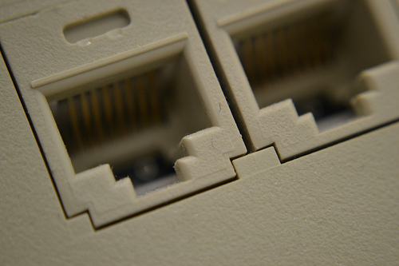
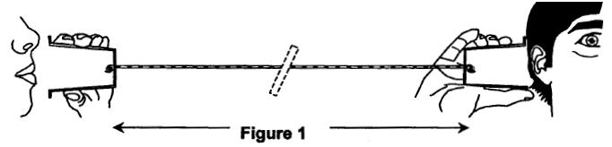

# Lecture 2: TCP Programming

## Table of Contents

1. [Objectives](#Objectives)
2. [Lecture](#Lecture)
   1. [Client-Server Programming](#ClientServerProgramming)
   1. [The TCP Protocol](#TCPProtocol)
   1. [The Socket API](#SocketAPI)
   1. [So… What Do Servers and Clients Do With the Socket API?](#UsingTheSocketApi)
   1. [Handling Concurrency in TCP Server](#HandlingConcurrency)
      1. [Single Process, Single-Threaded, Blocking Servers](#SingleProcessSingleThreadedBlocking)
      1. [Multi Process, Single-Threaded, Blocking Servers](#MultiProcessSingleThreadedBlocking)
      1. [Single Process, Multi-Threaded, Blocking Servers](#SingleProcessMultiThreadedBlocking)
      1. [Single Process, Single-Threaded, Non-Blocking Servers (multiplexing)](#SingleProcessSingleThreadedNonBlockingMultiplexing)
      1. [Single Process, Single-Threaded, Non-Blocking Servers (asynchronous programming)](#SingleProcessSingleThreadedNonBlockingAsynchronous)
3. [Resources](#Resources)
   1. [MUST read](#ResourcesMustRead)
   2. [Additional Resources](#ResourcesAdditional)
4. [What Should I Know For The Test And The Exam?](#Exam)


## <a name="Objectives"></a>Objectives

The goal of this lecture is to **introduce key concepts of network programming** and to explain how developers can write **client and server programs** that use the **TCP protocol** to communicate with each other. The goal is to describe the **Socket API**, which is standard way to do it, available **across operating systems and programming languages**.

After this lecture, you should be able to **write a multi-threaded TCP server in Java**, listening for connection requests. You should be able to **write a TCP client** that initiates a connection with this client. Finally, using your knowledge of IO processing, you should be able to **exchange a stream of bytes between the client and the server**. This will provide a foundation, on top of which you will be able to implement application-level protocols (such as HTTP) in your own programs.

## <a name="Lecture"></a>Lecture

### <a name="ClientServerProgramming"></a>1. Client-Server Programming

You are certainly already familiar with the notions of **network clients** and **servers**, at least intuitively. When you use your web browser to read the daily news, you use an HTTP client that talks to an HTTP server. When you send an e-mail, you use a SMTP client that talks to a SMTP server. When you use an online music streaming service, you use a client that implements a custom protocol to talk to a server in the cloud.

While all of these applications are different, they have some things in common:

*  The **server is a program** that implements some functionality (we can say that it offers some kind of **service**). The server appears to be ***always on***, **waiting for clients** to contact him and to ask him to do something.


*  The **client is a program** that ***you* use** to benefit from this functionality. Depending on what you do in the user interface, the client contacts the server and asks him to do something on your behalf (that is why clients are sometimes called **user agents**).

*  The client and the server need a way to **exchange messages** (requests, replies, notifications, etc.). The **types of messages**, the **structure of messages**, **what needs to be done** when specific messages are received are all things that are specified in application-level protocols (in other words, HTTP, SMTP and the music stream service protocol have their own messages and rules)

*  In order to read and write messages, the clients and servers **need a way to read and write sequences of bytes**. *Very often*, they need to be able to do that in a **reliable way** (with guarantees that all the bytes written on one side will be received on the other, in the right order). This reliability is ensured by TCP.

*  The client and the server **ignore the implementation details** of the interlocutor on the other side. In particular, the client often does not know on which operating system the server runs. For many protocols, it does not know either in which programming language it as been written. 

When we talk about **client-server programming**, we talk about **using a programming language** to implement some sort of **communication protocol**, whether it is a standard one (e.g. HTTP) or our own proprietary one. **Modern programming languages and libraries make this surprisingly easy**. Simple clients and servers can literally be written in a couple of lines. Learning how to write these lines is very easy if you have some experience working with IOs (which you should, having survived the previous lecture!)

### <a name="TCPProtocol"></a>2. The TCP Protocol

In this course, **we assume that you are familiar with the TCP/IP protocol stack**. We assume that you know how IP is used to [exchange packets between hosts in interconnected networks](http://www.tcpipguide.com/free/t_IPFunctions.htm) and how TCP adds [multiplexing/demultiplexing](http://www.tcpipguide.com/free/t_TCPIPProcessesMultiplexingandClientServerApplicati.htm) and [reliability](http://www.tcpipguide.com/free/t_TCPReliabilityandFlowControlFeaturesandProtocolMod.htm) on top of IP. We also assume that you know how TCP defines what needs to be done in order to [establish and terminate a connection](http://www.tcpipguide.com/free/t_TCPBasicOperationConnectionEstablishmentManagement.htm) between a **caller** and a **callee**.

[](http://www.cdandlp.com/item/1/44706-130112-0-1-0/115493154/claude-francois-le-telephone-pleure.html)

Here are some of the key points that you certainly remember:

* **By analogy, TCP can be described as a kind of telephone system**. Imagine that you are running a taxi company (you are offering a taxi booking service). You have published your company phone number, so customers know about it. The receptionist is patiently waiting for customers to call. When a client needs a ride, he makes a phone call. If the receptionist is available, he picks up the phone. A connection has now been established and the two persons can exchange messages, until someone hangs up. The TCP protocol handles all these steps: call setup, conversation, call termination.

* Whereas **IP is a host-to-host communication protocol**, **TCP is an application-to-application communication protocol** (in other words, TCP is used for a process running on a host to communicate with another process running on another host). Since multiple processes may run on the same host and may wish to use TCP, the notion of **port** is used for **multiplexing**/**demultiplexing** TCP segments. With TCP, it is an application (as opposed to the operating system) that decides to use the protocol, when and how.

* For a **server application**, that means **using a function** to **bind** (a *socket*, more on this later) to an available port and another function to **listen for connection requests**. For a **client application**, that means **using a function** to **initiate a connection** with a server, identified by an IP address and a port number. For both the client and the server, once the connection has been established, that also means **using functions** to send and receive bytes to the interlocutor. That sounds good, but what does it actually mean to ***use these all of these functions***? In what interface, in what API are these functions defined?

Well, that is precisely what we want to explain in this lecture! As we are just about to see, it is the **Socket API** that provides all the enlisted functions and supporting data structures, in a **standardized way**.


### <a name="SocketAPI"></a>3. The Socket API

[](http://www.flickr.com/photos/baldbrad/6985094162/)

The **Socket API** is a standard programming interface which has its origins in the **Unix** operating system, but which is now available across operating systems and programming languages. To simplify things a bit, the API **provides a list of functions and data structures** to use TCP (and as we will see in the next lecture, to use UDP) from application-level code. In particular, the API allows us to:

* **once connection has been established, communicate with a remote application through a pair of *sockets***. Imagine a **virtual pipe** that would connect a client and a server. The client and the server each see **one extremity of the pipe**. Each extremity is called a socket and is used to read bytes from and send bytes to the other side of the pipe. In technical terms, **a socket is a data structure identified by 4 values**: a local IP address, a local port, a remote IP address and a remote port.

* **Bind a socket to an 'address'** (where an address is actually the combination of an IP address and of a port). This is something typically done when a server starts up and plans to listen for incoming connection requests, on a given network interface and on a given port (e.g. on *192.168.1.12:8080*). Binding a socket to an address means that the **local address** and **local port** fields of the socket are now set.

* Start **listening**, i.e. accepting connection requests, on a given port. This is done by setting a bound socket to **listening mode**. Once this is done, **the operating system will forward him the TCP segments** that have destination port matching the local port of the socket. Whenever a **connection request is made by a client**, a **new socket** is created (so, *we now have 2 sockets*: the one used to listen for connection requests and one for talking with the client). The values for the remote address and remote port of this socket are set to the client's IP address and local port (which most of the time has been randomly assigned by the remote operating system).

* **Initiate a connection request** with a remote process. This is done by a client that wants to contact and interact with a server.

* **Read and write bytes through a socket**. This can be done either by providing **socket-specific functions**, such as `send()` and `receive()` (e.g. in C), or by working with **more generic functions** that work on file descriptors (e.g. `read()` and `write()` in C) or IO streams (e.g. in Java).

* **Close a socket**, when the connection with the remote host (client or server) can be terminated.

* Finally, the Socket API also provides **utility methods** to work with **network interfaces**, **IP addresses** and to perform **data conversions**.


### <a name="UsingTheSocketApi"></a>4. So… What Do Servers and Clients Do With the Socket API?

[](http://www.chimix.com/an11/kine11/audio1.html)

The following pseudo code shows the the typical sequence of operations performed by a server and a client in order to communicate. Let us start by looking at the server (note that steps 1 and 2 can be combined in a single function call in some languages):

```
What the server does…
1. Create a "receptionist" socket
2. Bind the socket to an IP address / port
3. Loop
   3.1. Accept an incoming connection (block until a client arrives)
   3.2. Receive a new socket when a client has arrived
   3.3. Read and write bytes through this socket, communicating with the client
   3.4. Close the client socket (and go back to listening)
4. Close the "receptionist" socket
```

Now, let us look at what the client is doing (again, steps 1 and 2 are often done in a single function call):

```
What the client does…
1. Create a socket
2. Make a connection request on an IP address / port
3. Read and write bytes through this socket, communicating with the client
4. Close the client socket
```

The details of the syntax depend on the programming language used to implement the client and/or the server. As mentioned before, the Socket API is available in pretty much every programming language. Here are some pointers to API documentations that you will get you started:

* [Java](http://docs.oracle.com/javase/7/docs/api/java/net/package-summary.html)
* [C](http://beej.us/guide/bgnet/output/html/multipage/index.html) This is a great guide, which will provide you all the information you need to write client-server applications in C. Check it out!
* [python](http://docs.python.org/2/library/socket.html)
* [Node.js](http://nodejs.org/api/net.html)
* [Microsoft .Net](http://msdn.microsoft.com/en-us/library/System.Net.Sockets%28v=vs.110%29.aspx)
* [PHP](http://in3.php.net/sockets)

The following code snippets show how the previous pseudo code can be implemented in Java.

```
// Server (exception handling removed for the sake of brevity)

boolean serverShutdownRequested = false;
ServerSocket receptionistSocket = new ServerSocket(80); 

while (!serverShutdownRequested) {
  Socket clientSocket = receptionistSocket.accept(); // blocking call
  InputStream is = clientSocket.getInputStream();
  OutputStream os = clientSocket.getOutputStream();
  
  int b = is.read(); // read a byte sent by the client
  os.write(b);       // send a byte to the client
  
  clientSocket.close();
  is.close(); 
  os.close();
}

receptionistSocket.close();
```

```
// Client (again, exception handling has been removed)

Socket socket = new Socket("www.heig-vd.ch", 80);

InputStream is = socket.getInputStream();
OutputStream os = socket.getOutputStream();

int b = 22;
os.write(b);       // send a byte to the server
b = is.read();     // read a byte sent by the server

clientSocket.close();
is.close(); 
os.close();
```

In the code above, every byte that is written by the client on its `os` output stream will arrive on the server's `is` input stream. Similarly, every byte written by the server on its `os` stream will arrive on the client's `is` stream. We clearly see that the communication is bidirectional and happens through 2 sockets (remember: **one socket is one extremity of the virtual pipe**).


### <a name="HandlingConcurrency"></a>5. Handling Concurrency in TCP Servers

[](http://www.flickr.com/photos/roboppy/10545877374/)

For most TCP servers, we want to be able to **talk to more than one client at the same time**. Furthermore, we want to do it in a *scalable* way, with the ability to talk to gazillions of clients at the same time (because we are living in 2014 and we are [web scale](http://www.youtube.com/watch?v=b2F-DItXtZs)). There are different ways to achieve this goal, by using **one or more processes** and **one or more threads**. 

Let us compare 5 alternatives:

* single process, single-threaded, blocking servers
* multi process single-threaded, blocking servers
* mono process, multi-threaded, blocking servers
* mono process, single-threaded, non-blocking servers (multiplexing)
* mono process, single-threaded, non-blocking servers (asynchronous programming)

####<a name="SingleProcessSingleThreadedBlocking"></a>5.1. Single Process, Single-Threaded, Blocking Servers

This is **the simplest type of server that you can write**, but it as a limitation that makes it almost unviable. Indeed, this type of server is able to **talk to only one client at the time**. For some stateless protocols (where the client and the server communicate during a very short period) and when the traffic is very low, it might be an option, but frankly… Consider the following Java code:

```
try {
	serverSocket = new ServerSocket(PORT);
} catch (IOException ex) {
	Logger.getLogger(SingleThreadedServer.class.getName()).log(Level.SEVERE, null, ex);
	return;
}
		
while (true) {
	try {
		
		LOG.info("Waiting (blocking) for a new client…");
		clientSocket = serverSocket.accept();
		
		in = new BufferedReader(new InputStreamReader(clientSocket.getInputStream()));
		out = new PrintWriter(clientSocket.getOutputStream());
		String line;
		boolean shouldRun = true;
		
		LOG.info("Reading until client sends BYE or closes the connection...");				
		while ( (shouldRun) && (line = in.readLine()) != null ) {
			if (line.equalsIgnoreCase("bye")) {
				shouldRun = false;
			}
			out.println("> " + line.toUpperCase());
			out.flush();
		}
		
		LOG.info("Cleaning up resources...");				
		clientSocket.close();
		in.close();
		out.close();
		
	} catch (IOException ex) {
	…
	}
}

```
The following line, which is used to set the socket in listening mode and to accept connection requests from clients, is very important: 

```
        clientSocket = serverSocket.accept();
```
**You have to understand that `accept()` is a *blocking* call**. **This means that the execution of the current thread will suspend until a client arrives**. Nothing else will happen. So here is what happens when you execute the server. It will bind a socket to a port, wait for a client to arrive, serve that client (which might take a while, depending on the application protocol…) and *only then* be ready to serv the next client. In other words, clients are served in pure sequence. *That sounds a bit like a Cronut queue…*

Have a look at the [StreamingTimeServer](../examples/04-StreamingTimeServer) example, which shows how a very (too) simple TCP server can be implemented in Java.

####<a name="MultiProcessSingleThreadedBlocking"></a>5.2. Multi Process, Single-Threaded, Blocking Servers

To improve the situation and to be able to handle several clients concurrently, a first idea is to use multiple processes. This was the standard approach for a long time, when servers where written in C and before multi-threading libraries became popular. The apache httpd server used (and still gives the option to use) this method.

The model works as follows: the server starts in a first process, which binds a socket and accepts incoming connection requests. **Each time a client makes a connection request, a child process is forked**. Since a child process inherits file descriptors from its parent, the new process has a socket that is ready to use for talking with the client. At this point, we thus have two processes that work in parallel: the parent does not care about the first client any more and can go back to listening for other clients, while the child can take care of the client and service its request.

The following code snippet, which is part of the great [Beej's Guide to Network Programming](http://www.beej.us/guide/bgnet/output/html/multipage/index.html), shows how this can be implemented in C (the complete code is available [here](http://www.beej.us/guide/bgnet/output/html/multipage/clientserver.html#simpleserver)):

```
printf("server: waiting for connections...\n");

while(1) {  // main accept() loop
    sin_size = sizeof their_addr;
    new_fd = accept(sockfd, (struct sockaddr *)&their_addr, &sin_size);
    if (new_fd == -1) {
        perror("accept");
        continue;
    }

    inet_ntop(their_addr.ss_family,
        get_in_addr((struct sockaddr *)&their_addr),
        s, sizeof s);
    printf("server: got connection from %s\n", s);

    if (!fork()) { // this is the child process
        close(sockfd); // child doesn't need the listener
        if (send(new_fd, "Hello, world!", 13, 0) == -1)
            perror("send");
        close(new_fd);
        exit(0);
    }
    close(new_fd);  // parent doesn't need this
}
```

While this approach works, it is not perfect and **can show limitations under heavy load**. Forking a process is a relatively **expensive operation** (in terms of time and resource consumption). This is why we say that the approach does not scale very well.

####<a name="SingleProcessMultiThreadedBlocking"></a>5.3. Single Process, Multi-Threaded, Blocking Servers

Another approach, which has become very popular with the rise of the Java platform and of multi-threading libraries, is to **rely on multiple threads instead of multiple processes**. Remember that a thread is often described as a **lightweight process** (this indicates that there is **less overhead** in thread creation and switching, in comparison with process creation and switching).

This approach follows the same logic and structure as the previous one, but is implemented in a single process. A first thread is started and is responsible for accepting connection requests in a loop. **Whenever a client arrives, a new thread is created to handle the communication with the client**. This allows the "receptionist" thread to immediately go back to welcoming other clients. If you are not familiar with multi-threaded programming in Java, you should refer to [this section](http://docs.oracle.com/javase/tutorial/essential/concurrency/threads.html) of the Java tutorial.

The following Java code illustrates the idea. Here are the key points about the code:

* The `MultiThreaderServer` class contains two inner classes. These two inner classes implement the standard `Runnable` interface, which means that their `run()` method is meant to execute on its own thread.

* The responsibility of the `ReceptionistWorker` class is to accept incoming connection requests, in a loop. In other words, it should create a server socket and accept connection requests. Whenever a client arrives, it should create a new instance of the `ServantWorker` class, pass it to a new instance of the `Thread` class, which it should then start. When this is done (which is fast), the class should go back to accepting connection requests.

* The responsibility of the `ServantWorker` class is to take care of a particular client. It provides a `run()` method that executes on its own thread. This method has access to the input and output streams connected to the socket and can use them to receive bytes from, respectively send bytes to the client.


```
public class MultiThreadedServer {

	final static Logger LOG = Logger.getLogger(MultiThreadedServer.class.getName());

	public void serveClients() {
		new Thread(new ReceptionistWorker()).start();
	}

	private class ReceptionistWorker implements Runnable {

		@Override
		public void run() {
			ServerSocket serverSocket;

			try {
				serverSocket = new ServerSocket(PORT);
			} catch (IOException ex) {
				LOG.log(Level.SEVERE, null, ex);
				return;
			}

			while (true) {
				LOG.info("Waiting (blocking) for a new client...");
				try {
					Socket clientSocket = serverSocket.accept();
					new Thread(new ServantWorker(clientSocket)).start();
				} catch (IOException ex) {
					LOG.log(Level.SEVERE, ex.getMessage, ex);
				}
			}

		}

		private class ServantWorker implements Runnable {

			Socket clientSocket;
			BufferedReader in = null;
			PrintWriter out = null;

			public ServantWorker(Socket clientSocket) {
				try {
					this.clientSocket = clientSocket;
					in = new BufferedReader(new InputStreamReader(clientSocket.getInputStream()));
					out = new PrintWriter(clientSocket.getOutputStream());
				} catch (IOException ex) {
					LOG.log(Level.SEVERE, ex.getMessage(), ex);
				}
			}

			@Override
			public void run() {
				String line;
				boolean shouldRun = true;

				try {
					LOG.info("Reading until client sends BYE or closes the connection...");
					while ((shouldRun) && (line = in.readLine()) != null) {
						if (line.equalsIgnoreCase("bye")) {
							shouldRun = false;
						}
						out.println("> " + line.toUpperCase());
						out.flush();
					}

					LOG.info("Cleaning up resources...");
					in.close();
					out.close();
					clientSocket.close();

				} catch (IOException ex) {
					if (in != null) {
						try {
							in.close();
						} catch (IOException ex1) {
							LOG.log(Level.SEVERE, ex.getMessage(), ex1);
						}
					}
					if (out != null) {
						out.close();
					}
					if (clientSocket != null) {
						try {
							clientSocket.close();
						} catch (IOException ex1) {
							LOG.log(Level.SEVERE, ex1.getMessage(), ex1);
						}
					}
					LOG.log(Level.SEVERE, ex.getMessage(), ex);
				}
			}
		}
	}
}
```

Even if threads are more lightweight than processes, this approach has also shown limitations under heavy load. For servers that need to handle a large number of concurrent connections, it has shown not be viable. Also note that this approach is sometimes combined with the previous one. In other words, some servers fork several process and use several threads in each of the processes. Have a look at the [apache httpd MPM worker module](http://httpd.apache.org/docs/2.4/mod/worker.html) for instance.

If you want to compare the behavior of single-threaded and multi-threaded servers in Java, have a loot at the [TcpServers example](../examples/07-TcpServers).

####<a name="SingleProcessSingleThreadedNonBlockingMultiplexing"></a>5.4. Single Process, Single-Threaded, Non-Blocking Servers (multiplexing)

Even if we are implementing a server with a single process and a single thread, there are ways to handle multiple clients concurrently. What this means is that there are ways to **monitor more than one socket at the time** and to react to incoming data on them. The first one is to set the sockets in a particular state (non-blocking). to use specific system calls. The way to implement this model depends on the operating system (i.e. it depends on the system calls supported by the operating system). While solutions have existed for a long time, they have evolved over the years. 

To understand how multiplexing works, **let us take the analogy of a restaurant**. Waiters are taking care of customers, sitting at their tables: 

* **Without multiplexing**, we could think of two approaches for serving a room full of customers. The **first approach** would be to have a single waiter (single process, single thread) in the restaurant. We would ask him to take care of each table, in sequence. In other words, the waiter would start to serve a new table only when the previous one has be fully served (greetings, drinks, food, desert, bill, greetings). That does not seem very realistic, does it? The **second approach** would be to hire more waiters (one waiter per table). The job of a waiter would still be the same, in other words to take care of a single table at the time. This approach (multiple processes and/or threads) is better, but it proves to be quite expensive for the restaurant who has extra salaries to pay.

* **With multiplexing**, the idea is to assign a number of tables to each waiter (maybe there is one, maybe there are several). The job of the waiter is now a bit different. His job is to have an eye on what is happening at each of *his* tables. Is anyone out of bread at any of my tables? Is anyone calling me at any of my tables? Is anyone asking for the bill at one of my tables? It is an interesting idea, but we have to be careful about the time it takes to check the status of all assigned tables. Imagine a waiter who would have to check what is happening at 100 tables. He would not have the time to do anything else (performance is an issue with some of the related system calls).

How does it work in practice? We have mentioned special system calls before. The `select()` and `poll()` functions are two of them. They work with sockets that have been put in a special, *non-blocking* state. As a result, the usual calls (`accept()`, `read()`, `write()`) do not block the execution of the current thread. The `select()` and `poll()` functions are blocking, but they allow the programmer to give a list of sockets. The execution of the thread will block until *something* happens to *at least one* of the sockets in the list. Have a look at [Beej's Guide to Network Programming](http://www.beej.us/guide/bgnet/output/html/multipage/advanced.html#select), which has a section dedicated to this topic with code examples.


####<a name="SingleProcessSingleThreadedNonBlockingAsynchronous"></a>5.5. Single Process, Single-Threaded, Non-Blocking Servers (asynchronous programming)

There is another way to handle multiple connections at the same time, with a single process and a single thread. It also consists of using non-blocking IOs, but implies a different programming style and control flow structure. It is associated with an event-based approach and with the use of callback functions.

Before we get to the technical details, let us consider a real world analogy again. This time, we will think about what is happening at a coffee shop, where customers have to order and collect their drinks at the counter (self-service):

* **As a customer, when you enter the coffee shop**, you have to **stand in a first queue**. You have to wait for someone to take your order and collect your money. You then have to **move into a second queue**, waiting for someone to prepare your drinks. **This is the world of synchronous customer service**. It works, but it does not allow you to make the most efficient use of your time. When you are waiting in a queue, you cannot do anything valuable at the same time. If there is a single employee doing everything (single process, single thread), the queue will grow quickly. Hiring additional employees to have parallel queues (multiple threads) is of course possible, but it has a cost.

* **Compare this scenario** with what happens in some coffee shops. Firstly, instead of directly standing in a queue, you pick up a ticket with a number (e.g. '67'). You then go to a table, sit down, take your laptop out of your bag and start working on your RES lab. At some point, you hear "Customer number 67, please!". You know that you can now stand up and go directly to the person who takes the order and collects the money. No waiting time. You place your order, pay for it, and receive a small device. You go back to your table and can resume your work on the damn lab… A couple of minutes later, the device starts to flash, letting you know that your order is ready. You get up, walk to the distribution area and collect your drink (again, without having to wait). **This is the world of asynchronous customer service**. It works because **you are notified when certain events happen**: *'Someone is available to take your order'*, *'Your order is ready'*, etc. It also works because you know how to behave when you receive these notifications (as we will see, you implement *callback* functions).

In technical terms, doing asynchronous IO programming consists of using non-blocking IOs (hence of setting sockets in non-blocking state) in combination with an event-based approach. This is possible in various programming environments and has become very popular. It is one of the features of the *Node.js platform*, which applies the asynchronous pattern across the board. It is also one aspect of the [*reactive programming*](http://www.reactivemanifesto.org/#event-driven) approach. To illustrate what that means, consider the following code:

```
// This is an example for a simple echo server implemented in Node.js. It
// demonstrates how to write single-threaded, asynchronous code that allows
// one server to talk to several clients concurrently. 
//
// readline is a module that gives us the ability to consume a stream line
// by line

var net = require('net');
var readline = require('readline');

// let's create a TCP server
var server = net.createServer();


// it can react to events: 'listening', 'connection', 'close' and 'error'
// let's register our callback methods; they will be invoked when the events
// occur (everything happens on the same thread)
server.on('listening', callbackFunctionToCallWhenSocketIsBound);
server.on('connection', callbackFunctionToCallWhenNewClientHasArrived);

// we are ready, so let's ask the server to start listening on port 9907
server.listen(9907);

// This callback method is invoked after the socket has been bound and is in
// listening mode. We don't need to do anything special.
function callbackFunctionToCallWhenSocketIsBound() {
	console.log("The socket is bound and the server is listening for connection requests.");
	console.log("Socket value: %j", server.address());
}

// This callback method is invoked after a client connection has been accepted.
// We receive the socket as a parameter. We have to attach a callback function to the
// 'data' event that can be raised on the socket.
function callbackFunctionToCallWhenNewClientHasArrived(socket) {
	
	// We wrap a readline interface around the socket IO streams; every byte arriving
	// on the socket will be forwarded to the readline interface, which will take care
	// of buffering the data and will look for end-of-line separators. We will not register
	// a callback handler on the socket (it is a possibility), but rather on the readline
	// interface. The 'line' events are raised whenever a new line is available.
	var rl = readline.createInterface({
	  input: socket,
	  output: socket
	});
	
	rl.on('line', callbackFunctionToCallWhenNewDataIsAvailable);
	
	// This callback method is invoked when new data is available on the socket
	// We can process it, which in our case simply means dumping it to the console
	function callbackFunctionToCallWhenNewDataIsAvailable(data) {
		console.log("Client has sent: " + data);
		if (data.toString().toUpperCase() == 'BYE') {
			console.log("Client has sent 'bye', closing connection...");
			socket.end();
		} else {
			socket.write(data.toString().toUpperCase() + '\n');						
		}
	}

  console.log('A client has arrived: ' + socket.remoteAddress + ":" + socket.remotePort);

}
```

This code implements a TCP server capable of servicing multiple clients at the same time, on a single thread. There are 2 important elements to look at in the code. Firstly, we see that the programmer has defined several callback functions. This is where he has expressed what to do when certain events happen. Secondly, he has subscribed to several types of events and registered the callback functions with them. In other words, he has expressed the fact that **when** some events happen, **then** some functions need to be called. Note that Node.js developers usually prefer to use **anonymous callback functions** (defined inline), but this example was written to emphasize the nature of the callback functions.

The code is available in the [TcpServerNode example](../examples/08-TcpServerNode), which you can run with the following command:

```
node server.js
```


## <a name="Resources"></a>Resources</a>

### <a name="ResourcesMustRead"></a>MUST read

* This [section](http://docs.oracle.com/javase/tutorial/networking/sockets/index.html) of the Java tutorial, which explains how to use the Socket API in Java.

### <a name="ResourcesAdditional"></a>Additional resources

* A [section](http://www.tcpipguide.com/free/t_TCPIPTransportLayerProtocolsTransmissionControlPro.htm) of the TCP/IP Guide dedicated to TCP, if you need a refresh on that topic. 

* [Beej's Guide To Network Programming](http://www.beej.us/guide/bgnet/output/html/multipage/index.html), which a great resource if you want to use the Socket API in C. 

* A [nice course](http://www.cs.dartmouth.edu/~campbell/cs50/socketprogramming.html) about network programming with the Socket API in C. 

* An example for a [simple TCP server](http://www.gnu.org/software/libc/manual/html_node/Server-Example.html) that uses non-blocking IOs and multiplexing with the `select()` system call.

* A [presentation](http://fr.slideshare.net/gncvalente/whats-so-special-about-nodejs
), with embedded videos, which introduces Nodes.js, talks about asynchronous IOs and about the C libraries used by Nodes.js. The presentation also has two interesting slides that compare apache (using threads) and nginx (using an event loop). Another [presentation](http://fr.slideshare.net/marcusf/nonblocking-io-event-loops-and-nodejs) on the same topic.

* An [article](http://www.onjava.com/pub/a/onjava/2002/09/04/nio.html) that explains how Java NIO adds non-blocking IO to Java IO. Another [article](http://www.ibm.com/developerworks/java/library/j-nio2-1/index.html?ca=dat) that explains how Java NIO.2 adds support for asynchronous IO to Java NIO. 

* The [home page](http://libevent.org/) for the lib event C library, which provides a unified interface for non-blocking IO programming, isolating the developer from operating system specific function calls. This [section](http://www.wangafu.net/~nickm/libevent-book/01_intro.html) of the documentation gives a good introduction to asynchronous IO.

## <a name="Exam"></a>What Should I Know For The Test and The Exam?

Here is a **non-exhausive list of questions** that you can expect in the written tests and exams:

* When writing a network client in Java, you have created a socket and established a connection with a TCP server. The variable `mySocket` holds a reference to this socket. How can you send bytes to the server?

* When writing a network server in Java, you want to bind a socket to port 2367 and accept at most 4 connection requests. How do you do that?

* What is the difference between a process and a thread?

* Describe 4 different ways to handle concurrency in TCP servers.

* Explain the difference between a synchronous and an asynchronous function call.

* **Write the Java code of a single threaded "echo" server**, which accepts connection on TCP port 3232. When a client connects, the server should send back the following bytes `'HELLO\n'`, read one line and send back this line converted to uppercase.

* **Write the Java code an "echo" client**, which connects to this server, sends the following bytes `'ThIS is a TeSt'`, reads the response and validates that the response is what was expected.

* **Write the Java code to make the single threaded "echo" server multi-threaded**. Be able to explain how the solution uses the `Runnable` interface and the `Thread` class.

