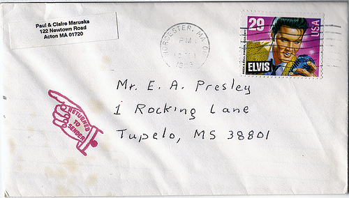

# Lecture 3: UDP Programming

## Table of Contents

1. [Objectives](#Objectives)
2. [Lecture](#Lecture)
   1. [The UDP Protocol](#UDPProtocol)
   1. [UDP in the Socket API](#SocketAPI)
   1. [So… How Do Clients and Servers Use UDP?](#UsingTheSocketApi)
   1. [Unicast, Broadcast and Multicast](#UnicastBroadcastMulticast)
   1. [Service Discovery Protocols](#ServiceDiscoveryProtocols)
3. [Resources](#Resources)
   1. [MUST read](#ResourcesMustRead)
   2. [Additional Resources](#ResourcesAdditional)
4. [What Should I Know For The Test And The Exam?](#Exam)


## <a name="Objectives"></a>Objectives

The goal of this lecture is to **continue our study of network programming** and to explain how developers can write **client and server programs** that use the **UDP protocol** to communicate with each other. 

After this lecture, you should be able to **write Java programs that send and receive UDP datagrams**. You should also be able to describe the notions of **unicast**, **broadcast** and **multicast** message distribution modes. Furthermore, you should be able to explain how **service discovery protocols** can be implemented thanks to multicast messaging. 

Last but not least, you should be **aware of what it means to use an unreliable transport protocol** as a basis for your application-level protocol. You should be able to describe what clients and servers have to do in order to deal with this unreliability.

## <a name="Lecture"></a>Lecture

### <a name="UDPProtocol"></a>1. The UDP Protocol

In the previous lecture, we have looked at the TCP protocol and seen as it offers **one way to transport application-level messages** across the network (in a reliable fashion). We have seen how the telephone system is a good analogy for how TCP works. In this lecture, we will look at **another transport protocol**, namely **UDP**. Here, it is the **postal system** that provides a useful analogy.

When you write and send letters, **you do not need to establish a synchronous connection** with your peers. You drop your letters in a mailbox, they are taken care of by the system and at some point they *should* be delivered at destination. 

[](http://www.flickr.com/photos/orlando-herb/4835564098/)


In the postal system, every letter is handled independantly and has all the **information required for the routing** (i.e. the elements of the destination address). Furthermore, the letter should also mention the **sender address**. When you receive a letter, this is very useful because it gives you the information you need if you want to **send back a response**. UDP applies the same logic: datagrams contain both the source and destination coordinates, which can be used by the recipients to prepare their replies.

Also, remember that in some situations, letters *may* get lost. Does that mean that it is impossible to specify and implement **reliable application-level protocols on top UDP** (which is a requirement for file transfer protocols for instance)? No, it is not, but the burden is on the application developer's shoulders. What is offered by TCP has to be implemented on top of UDP.

What does that mean concretely? What does the application developer need to do when implementing a UDP-based protocol? Here are a couple of important points:

* Firstly, **there are application-level protocols where this is not really an issue** (in other words, there are application protocols that are **tolerant to data loss**). Think of a video streaming application protocol: it does not matter if some of the data is lost. The worse that can happen is a lower quality. Think of a protocol used by sensors to report measurements to a data collection infrastructure (see this [example](../../2014/examples/09-Thermometers)). Again, loosing some measurements may be totally acceptable.

* For applications where data loss cannot be accepted, the client needs a way to **know if a datagram that it has sent has been received by the server**. If it thinks that the datagram has been lost, then it should try again and **resend the datagram**. That should remind you of the way TCP works: a combination of **acknowledgments** and **timers** are certainly one way to address this issue. 

* However, you should also remember that sometimes, the client will *think* that one of its datagrams has been lost, although it as actually been received and processed by the server. This would be the case if **it is the server's acknowledgment that has been lost or has arrived too late**. The consequence is that the server will then probably **receive multiple copies of the same datagram**. It needs to be aware of that possibility and act appropriately.

* For illustration purposes, **think of a rudimentary application-level protocol**, where clients can send commands to increase the value of a counter (there is a single counter managed by the server). Clients send  `INC-COUNTER` commands encapsulated in UDP datagrams. As you can guess, when the server receives an `INC-COUNTER` command, it increments the value of the counter by one. Let us consider the following scenarios:

  *  Let's imagine that the client sends 10 commands. If no datagram is lost, then at the end of the process, **the counter will have a value of 10**. Fine, but we *[know](http://en.wikipedia.org/wiki/Fallacies_of_Distributed_Computing)* that we are not living in an ideal world and that we *have to assume* that something bad will happen at some point.
  
  * **If some datagrams are lost** and not resent by the client, then **the counter will have a value smaller than 10**. As we have seen, the client and the server have to agree on an acknowledgment protocol. If the client does not receive an ack for a command *within a specified period*, it should resend the command.
  
  * **If the same command is sent multiple times** (because the client wrongly thinks that it has been lost) **and is processed multiple times** by the server, then **the counter will have a value greater than 10**. To avoid this problem, the server has to keep track of the commands that it has already processed and acknowledged. To be precise, it has to keep track of [non-idempotent](http://en.wikipedia.org/wiki/Idempotence#Computer_science_meaning) commands. That is where *stop-and-go* and *sliding window* algorithms are providing you with a proven solution. Have a look at the Trivial File Transfer Protocol ([TFTP](http://tools.ietf.org/html/rfc1350)) specification for an example of a reliable application-level protocol built on top of UDP. Also have a look at a [flaw](http://en.wikipedia.org/wiki/Sorcerer%27s_Apprentice_Syndrome) in the first design of this protocol.


### <a name="SocketAPI"></a>2. UDP in the Socket API

The **Socket API** provides functions for using UDP in application-level code. When using the C API, the first thing to be aware of is that it is when creating the socket that one specifies whether we want to use TCP or UDP. Compare the following two instructions:

```
// If we want to use TCP
int sock = socket(PF_INET, SOCK_STREAM, IPPROTO_TCP);

// If we want to use UDP
int sock = socket(PF_INET, SOCK_DGRAM, IPPROTO_UDP);    
```

Once we have a socket, we can use it both to **receive** and to **send** datagrams. In C, the developer does not use a special data structure that would represent a datagram. He uses the `sendto()` and `rcvfrom()` functions and passes byte arrays as parameters. Unlike with TCP, no connection has been established before making the calls to send and receive data. For that reason, when calling the `sendto()` function, the developer **needs to specify a destination address and a destination port**. Similarly, when using the `rcvfrom()` function, the developer has to pass a data structure, where he will **find the source address and port** after the call. 

```
// Let's send a datagram. The payload is the content of buffer and the destination
// address is specified in sa
bytes_sent = sendto(sock, buffer, strlen(buffer), 0,(struct sockaddr*)&sa, sizeof sa);
  
// Let's wait for a datagram to arrive. We will find the payload in the buffer and
// the return address in sa
recsize = recvfrom(sock, (void *)buffer, sizeof(buffer), 0, (struct sockaddr *)&sa, &fromlen);
```

### <a name="UsingTheSocketApi"></a>3. So… How Do Clients and Servers Use UDP?

### 3.1. Messaging Patterns

[](http://www.flickr.com/photos/yourpaldave/379687848/)

Different messaging patterns can be implemented with UDP:

* A common and simple pattern is the **fire-and-forget notification** pattern. The client prepares a datagram and sends it to one or more recipients. If data loss can be tolerated, nothing else needs to be done. In the [thermoter example](../../2014/examples/09-Thermometers), we use this pattern. Smart thermometers publish measurements on the network on a regular basis. No response is expected and if some measurements are lost, it is not an issue.

* Another common pattern is the **request-reply** pattern. The client prepares a datagram, in which it encapsulates an application-level message (in other words, the application level message is the payload of the UDP datagram). The client then **creates a datagram socket**, which will be **used both for sending the request and for receiving the response**. Note that it is possible, but **not required**, to specify a port. If no port is specified, then the operating system will automatically assign a free port to the socket. Now, remember what we said about the **return address** on physical letters. Every datagram (together with the encapsulating IP packet) sent via the socket will contain 4 values. Firstly, the **destination address and port** (**explicitly** set by the developer). Secondly, the **source address and port** (**automatically** set by operating system, retrieved from the socket). 

  After sending the datagram, the client will **wait for datagrams to come back** on the socket. When the **server** receives the datagram with the request (it has previously **created a socket on a known port** and is using it to accept datagrams), it extracts the application-level request, processes it, generates and application-level response and prepares a reply datagram. **It extracts the source IP and port from the request datagram, and uses these values as destination parameters for its reply**. Finally, it sends the datagram via its socket.

  In some cases, **one more question** needs to be addressed by the application developer (and by the application-level protocol specification). Imagine that a client sends 10 different requests to a server (*the protocol allows the client to send a new request before it has received a response to the previous one*). Let us assume that the server receives the 10 requests and sends back 10 responses. Because of the properties of UDP, **we have no guarantee that the requests and the responses will be received in sequential order**. Hence, it is quite possible that the client will receive the reply number 6 before the reply number 2. How can that work? **How can the client make sense of that unordered flow of responses**? The answer is that some information needs to be added to the application-level messages, in order to associate a reply with a given request. This information is often referred to as a **correlation identifier**. The client has to generate a different correlation identifier for each request and the server has to include it in the corresponding response.

  Have a look at the [COAP RFC](http://tools.ietf.org/id/draft-ietf-core-coap-18.txt) to see what this means in practice. In the RFC, check out *Paragraph 5.3. Request/Response Matching*. What the COAP RFC authors call a *token* is nothing else than a correlation identifier.
  
* We will look at a third common pattern a bit later, which relies on multicast or broadcast, and which we will present in the context of **service discovery protocols**.

### 3.2. Making API Calls

In **Java**, the API provides an **explicit abstraction** for dealing with datagrams: the `DatagramPacket` class. Developers use it both when sending and receiving UDP datagrams from their programs. Here are the important methods defined in the class, as defined in the [Javadoc](http://docs.oracle.com/javase/7/docs/api/java/net/DatagramPacket.html) documentation:

```
// Returns the IP address of the machine to which this datagram
// is being sent or from which the datagram was received.
public InetAddress getAddress();

// Returns the port number on the remote host to which this 
// datagram is being sent or from which the datagram was received.
public int getPort();

// Returns the data buffer. The data received or the data to be sent
// starts from the offset in the buffer, and runs for length long.
public byte[] getData();
```

Furthermore, datagrams are sent and received via sockets that are instances of the [`DatagramSocket`](http://docs.oracle.com/javase/7/docs/api/java/net/DatagramSocket.html) class. Notice that the class provides several constructors. Let us compare two of them:

```
public DatagramSocket() throws SocketException;
public DatagramSocket(int port) throws SocketException;
```
In the first constructor, we do not specify any port number. This is fine if we use the socket for **sending** datagrams. What will happen is that the system will assign us a **random UDP port** and use it as the **source port value** in the UDP header. If the application on the other side of the network wants to send us a response, it will be able retrieve and use this value as the **destination port value** in the response datagrams.

In the second constructor, we **specify a port number**. This means that we will be waiting for UDP datagams that have this value in the destination port of the datagram header. This approach is typically used to write a server according to an application-level protocol specification. **The specification defines the standard port** to be used by servers and clients. It is how client and servers can find each other to initiate an interaction.


### <a name="UnicastBroadcastMulticast"></a>4. Unicast, Broadcast and Multicast

As you remember, **applications that use TCP as a transport-layer protocol always see a pair of processes communicate with each other**. The server listens on a known port, the client makes a connection request on that port and when they are connected, they exchange data until the connection is closed. Standard one-to-one communication, which relies on [**unicast**](http://en.wikipedia.org/wiki/Unicast) data transmission. Another way to look at it is that the TCP segments that carry application-level messages are **always going to a single destination** (defined by the destination IP address and the destination port).

From your study of the TCP/IP stack and of protocols such as [ARP](http://en.wikipedia.org/wiki/Address_Resolution_Protocol) (used to *discover* the MAC address corresponding to an IP address), you should remember that there are **other data transmission models** within a network of nodes:
 
* [**Broadcast**](http://en.wikipedia.org/wiki/Broadcasting_%28networking%29) is one of them, where **a message is distributed to all nodes in the network**. As an analogy, think of what happens when **your mailbox is flooded with commercials** (just like your neighbour's). You didn't ask to receive the commercials and the advertising business did not need to know you in order to send you the glossy brochure with weekly deals. Everybody living in the city got them.

* [**Multicast**](http://en.wikipedia.org/wiki/Multicast) is another one, where **a message is distributed to all *interested* nodes in the network**. What does it mean for a node to *be interested* and how does it work in practice? Well, multicast protocols rely on the notion of *group*, which you can think of as **a kind of radio channel**. Just like music amateurs can decide to listen to particular radio channels, nodes in a network can decide to listen (i.e. *subscribe to*, *join*) to specific multicast groups. When other nodes (playing the role of the radio station) send messages to the group, then **all subscribers to that group will receive a copy of the message**.

Broadcast and multicast transmission models are very useful to implement certain interactions between clients and servers. They also offer ways to improve the efficiency of the communication within a network (e.g. by avoiding the need to resend the same information to multiple receipients and thus by reducing traffic). **UDP gives you a way to implement broadcast and multicast transmissions very easily**. However, be aware that there can be restrictions on the generated traffic. Sometimes, these restrictions are explicitly defined in standard specifications (for instance, broadcast in IPv4 networks is limited to the local network). Other times, they are enforced by system administration policies (for instance, **multicast is filtered on the HEIG-VD network**).

#### Implementing Broadcast in Your Programs

In order to broadcast a UDP datagram to all nodes on the local network, simply use the `255.255.255.255` broadcast address in the destination address of your datagrams. Note that the socket has to be set in a mode where it agrees to send broadcast datagrams (to avoid accidental broadcast storms). Here is how you would do it in Java:

```
// Sending a message to all nodes on the local network

socket = new DatagramSocket();
socket.setBroadcast(true);

byte[] payload = "Java is cool, everybody should know!!".getBytes();

DatagramPacket datagram = new DatagramPacket(payload, payload.length, InetAddress.getByName("255.255.255.255"), 4411);

socket.send(datagram);

```

And here is how you would do it in Node.js:

```
// Sending a message to all nodes on the local network

var dgram = require('dgram');
var s = dgram.createSocket('udp4');

s.bind(0, '', function() {
	s.setBroadcast(true);	
});

var payload = "Node.js rocks, everybody should know!";
message = new Buffer(payload);	

s.send(message, 0, message.length, 4411, "255.255.255.255", function(err, bytes) {
  console.log("Sending ad: " + payload + " via port " + s.address().port);
});

```

On the other side, if you implement an application that should listen for and process broadcasted datagrams, you do not need to do anything special. Just bind a datagram socket on the application-specific port. Here is what you do in Java:

```
// Listening for broadcasted messages on the local network

DatagramSocket socket = new DatagramSocket(port);

while (true) {
	byte[] buffer = new byte[2048];
	DatagramPacket datagram = new DatagramPacket(buffer, buffer.length);
	try {
		socket.receive(datagram);
		String msg = new String(datagram.getData(), datagram.getOffset(), datagram.getLength());
		System.out.println("Received a datagram with this message: " + msg);
	} catch (IOException ex) {
		Logger.getLogger(BroadcastListener.class.getName()).log(Level.SEVERE, ex.getMessage(), ex);
	}
}

```

And here is what you do in Node.js

```
// Listening for broadcasted messages on the local network

var s = dgram.createSocket('udp4');
s.bind(4411, function() {
  console.log("Listening for broadcasted ads");
});

// This call back is invoked when a new datagram has arrived.
s.on('message', function(msg, source) {
	console.log("Ad has arrived: '" + msg + "'. Source address: " + source.address + ", source port: " + source.port);
});
```

#### Implementing Multicast in Your Programs

In order to use multicast instead of broadcast in your programs (which is strongly recommended), what you have to do is pretty similar. Here are the additional tasks that you have to do:

1. You need to specify on which multicast group your program is goint to publish and subscribe. A multicast group is defined by an [IP address in a specific range](http://en.wikipedia.org/wiki/Multicast_address).

2. **In Java**, you need to use a special class, namely `MulticastSocket`, in order to listen and receive datagrams published on a multicast group.

3. This class defines two methods, namely `joinGroup(InetAddress group)` and `leaveGroup(InetAddress group)`. You use these methods to subscribe to and unsubscribe from the specified group.

Here is Java code for subscribing to a multicast group:

```
private InetAddress multicastGroup;
int port;
MulticastSocket socket;

public MulticastSubscriber(int port, InetAddress multicastGroup) {
	this.port = port;
	this.multicastGroup = multicastGroup;
	try {
		socket = new MulticastSocket(port);
		socket.joinGroup(multicastGroup);
	} catch (IOException ex) {
		Logger.getLogger(BroadcastListener.class.getName()).log(Level.SEVERE, null, ex);
	}
}
```

And here is the Node.js equivalent:

```
var dgram = require('dgram');
var s = dgram.createSocket('udp4');

s.bind(protocol.PROTOCOL_PORT, function() {
  console.log("Joining multicast group");
  s.addMembership(protocol.PROTOCOL_MULTICAST_ADDRESS);
});
```


### <a name="ServiceDiscoveryProtocols"></a>5. Service Discovery Protocols

[](http://www.nytimes.com/2008/10/09/us/09water.html?scp=1&sq=waterford%20possessed&st=cse&_r=0)

As we have seen before, one particularity of broadcast and multicast data transmission is that **the sender of a message does not need to know who the consumer(s) of that message will be**. In the case of broadcast, the sender knows that *all nearby nodes* will receive it. In the case of multicast, the sender knows that *all nodes that have expressed their interest* will receive it.

That is a property that is very useful in situations, where **you want to find out whether some sort of service provider is *around* and *available*** and where you are requesting for *contact information*. As an analogy, think about what is happening when a pregnant woman breaks water in an airplane. Most likely, someone will shout "Is there a doctore on board!?" (i.e. the request for a *delivery* service will be addressed to all passengers). If one or more doctors are present, they will manifest themselves and an interaction between the pregnant woman and one doctor will then be able to start.

[]()

There are **at least two methods for supporting service discovery** in a dynamic environment:

1. **The first one consists for the service providers to periodically advertise their presence**. Imagine a printer that would publish a UDP datagram on a multicast group every 5 seconds. A laptop that would be looking for available printers would create a datagram socket, join the multicast group (effectively expressing its interest in printers) and would thus receive the presence datagrams. The presence datagrams should contain the contact details (i.e the data that is required for the laptop to initiate an interaction with the printer and use its printing service).

2. **The other one works in other direction.** It consists for the printers to join a multicast group and for the printers to send datagrams containing a message with the semantic *"I am looking for a printing service"*. When receiving these requests, the printers should send back a message informing the laptop that they are available and giving the required contact details.

## <a name="Resources"></a>Resources</a>

### <a name="ResourcesMustRead"></a>MUST read

* This [section](http://docs.oracle.com/javase/tutorial/networking/datagrams/index.html) of the Java tutorial, which explains how to use UDP in Java.

* This [section](http://www.beej.us/guide/bgnet/output/html/multipage/syscalls.html#sendtorecv) and this [section](http://www.beej.us/guide/bgnet/output/html/multipage/clientserver.html#datagram) of Beej's Guide to Network Programming.


### <a name="ResourcesAdditional"></a>Additional resources

* The [COAP RFC](http://www.ietf.org/id/draft-ietf-core-coap-18.txt), which is an example for a protocol built on top UDP and which has reliability constraints. COAP is a protocol that was developed for Internet-of-Things (IoT) applications.

* The [TFTP RVD](https://www.ietf.org/rfc/rfc1350.txt), which is an example for a simple file transfer protocol that uses a stop-and-go algorithm for reliability and datagram ordering.

* Node.js [documentation](http://nodejs.org/api/dgram.html) on how to use datagram sockets.


## <a name="Exam"></a>What Should I Know For The Test and The Exam?

Here is a **non-exhausive list of questions** that you can expect in the written tests and exams:

* Explain the difference between unicast, broadcast and multicast transmission models.

* Describe a situation where it is a good idea to broadcast datagrams on the local network.

* Describe an application that makes use of multicast datagram distribution.

* Write the Java code for a client-server pair, which communicate with each other with messages encapsulated in UDP datagrams.

* Explain the notion of service discovery. Explain how you would specify a protocol allowing chat clients to discover available chat servers. Explain how you would implement it with multicast.

* Is it possible to implement reliable application-level protocols on top of UDP? If no, explain why. If yes, explain how.

* Give one reason why you would use UDP instead of TCP as a transport protocol for your application-level protocol.
