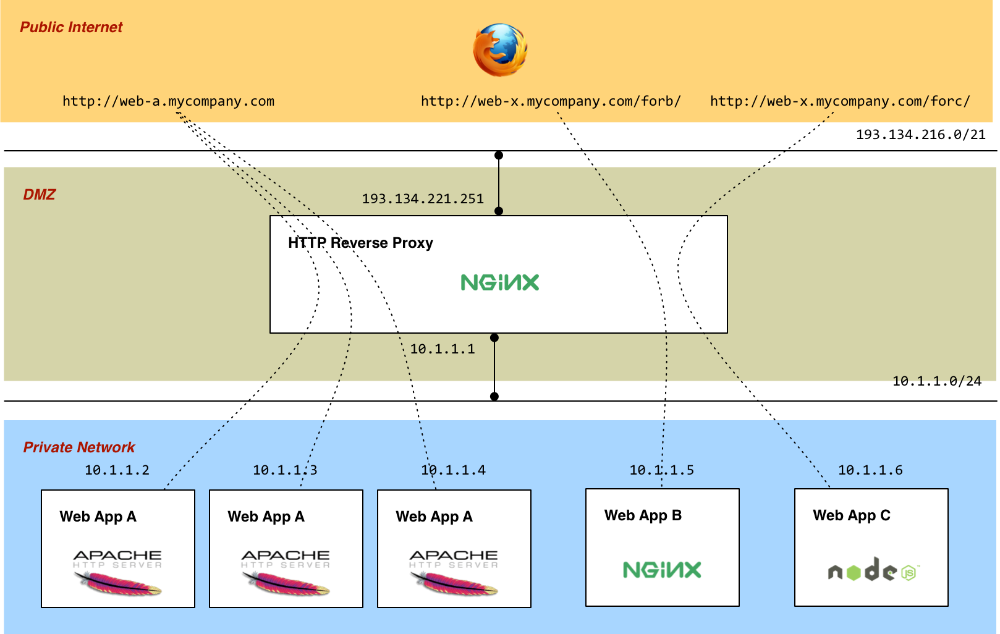

# Lecture 5: Web Infrastructure

## Table of Contents

* [Objectives](#Objectives)
* [Lecture](#Lecture)
   * 1 - [Introduction](#Introduction)
   * 2 - [Non-Functional Requirements, aka Systemic Qualities](#SystemicQualities)
   * 3 - [HTTP Reverse Proxies and Load Balancers](#ReverseProxies)
   * 4 - [Virtualization and Provisioning Technologies](#Virtualization)
* [Resources](#Resources)
   1. [MUST read](#ResourcesMustRead)
   2. [Additional Resources](#ResourcesAdditional)


## <a name="Objectives"></a>Objectives

Until now, we have focused on two aspects of the HTTP protocol (and of application-level protocols in general). Firstly, have looked at what **developers** need to do in order to implement protocols in client and server programs (how to use classes and methods for managing IOs, how to use the socket API, etc.). Secondly, we have looked at the protocol **specification** and at the rules that it defines (syntax and semantics of messages, connection and state management, etc.).

In this lecture, we will look at HTTP from another perspective, namely the **infrastructure** perspective. As you can imagine, a company running a service (whether this service is a content publication web site or a web application) on top of HTTP is unlikely to *just* install a single HTTP server and let it handle all the traffic. Think about the [CNN](http://www.cnn.com) web site or the [local e-commerce service](http://www.leshop.ch). **Because of various constraints (security, performance, availability, scalability), you can imagine that the infrastructure enabling these services is a bit more sophisticated than a single HTTP server running on a single machine directly accessible from the Internet.**

The objective of this lecture is to **look at the building blocks of a typical web infrastructure** and to show how they can be put together and configured. In particular, we will look at the role of HTTP reverse proxies and show that they are useful for various reasons. Another objective of this lecture is to **introduce some modern virtualization and infrastructure management technologies**, which we will use to create a multi-nodes setup on our machines. We will explain how different technologies complement each other and use them in the lab.
 

## <a name="Lecture"></a>Lecture

### <a name="Introduction"></a>1. Introduction

In this lecture, we will cover three topics:

* We will start by introducing the notions of *non-functional requirements* and of *systemic qualities*. Note that these notions are not specific to HTTP, nor to web infrastructures, but that they apply to any kind of service or system. We will take a closer look at some specific systemic qualities, namely **scalability**, **availability**, **performance** and **security**.

* We will then describe a typical web infrastructure and see how it consists of several nodes. In particular, we will describe the role of **reverse proxies** and of **load balancers**. We will explain that introducing these components in the infrastructure is a way to address several non-functional requirements (again, we will talk about scalability, availability, performance and security).

* Finally, we will introduce three **virtualization** and **infrastructure management **technologies: **Virtual Box **(which you certainly already know), **Vagrant** (which makes it easier to work with Virtual Box in a repeatable way) and **Dockers** (which allows you to run lightweight containers in your Virtual Box VM). In the lab, we will use Dockers to create a web infrastructure with multiple nodes (reverse proxy, load balancer, web servers, application servers), all running on your machine.


### <a name="SystemicQualities"></a>2. Non-Functional Requirements, aka Systemic Qualities

In every IT project, there are **two types of requirements**. Firstly, there are [**functional requirements**](http://en.wikipedia.org/wiki/Functional_requirements), which specify *what* the system should do, i.e. what *features* it should offer to users. Secondly, there are [**non-functional requirements**](http://en.wikipedia.org/wiki/Non-functional_requirement), which specify *how* the system should behave and what qualities it should exhibit.

**To illustrate this notion with an example, think about an e-commerce web site:**

* The **functional requirements** specify the **features** that should be offered to **customers** ("I should be able to browse products", "I should be able put products in my shopping cart", "I should be able to checkout and pay for my purchases"). The functional requirements also specify the features that should be offered to other types of users, including **marketing experts** ("I should be able to get statistics about sales"), **IT staff** ("I should be able to see how many users have accessed the service in the last 2 hours"). You may be familiar with the notions of **use cases** or **user stories**, commonly used in software development methodologies to document functional requirements.

* The **non-functional requirements** specify various constraints or characteristics for the system behavior. For instance, a requirement might specify that "at least 1'000 users should be able to use the service concurrently". A requirement might specify that "the maximum down-time (i.e. unavailabilty) for the service is 5 minutes per year". A requirement might specify that "the average response time should be less than 600 ms and the maximum response time should be less than 2000 ms". A requirement might specify that "two factors should be used to authenticate users accessing the service back-office interface". As you can see, non-functional requirements cover different areas, including scalability, availability, performance and security.

In english, **many systemic qualities have names ending with the *-ilty* suffix**: availab*-ilty*, scalab*-ilty*, exensib*-ilty*, usab*-ilty*, testab*-ilty*, maintainab*-ilty*, etc. For this reason, people often use the word "**ilities**" as a synonym for non-functional requirements. **Systemic quality** is another synonym for the same concept.

We will not discuss all systemic qualities here and will only consider a few of them, namely performance, scalability, availability and security. We will start by defining each of these qualities and later show how they can be addressed in a typical web infrastructure.

#### <a name=""></a>2.1. Performance

Performance is a rather generic term and can mean different things. Very often, two dimensions of performance are considered when specifying non-functional requirements:

* The first one is the **response time** experienced by users. For web applications, it is generally measured in milliseconds. Specifying target **response times** for a web application can be a bit tricky, especially if the application is somewhat complex. The same requirements may not apply across all features (for an e-commerce service, think of a feature used by customers while they shop, vs a feature used by company employees once in a month). Hence, **non-functional requirements are often specified in the context of a particular use case**. In other words, if you have a use case or a user story of the form "As a customer, I want to add a product in my shopping cart", then it is a good practice to add a note about the performance expectations directly in the use case documentation (e.g. "The average response time for this use case should be less than 400 ms"). When dealing with response time, you also need to consider network latency. If your service is used globally, with users in different countries, you may have to distribute your infrastructure if you have aggressive requirements.

* The second one is **throughput**, which measures the number of requests that can be processed within a given time frame. For instance, you may specify that "The service should sustain a load of at least 1'200 requests per second". In some cases, you may specify additional constraints, by specifying resource consumption requirements ("The service should sustain a peak load of 2'000 requests per second with a CPU consumption of max 80% per node") or response time requirements ("The service should sustain a peak load of 2'000 requests per second and offer an average response time below 1000 ms").

#### <a name=""></a>2.2. Scalability

Intuitively, scalability is often associated with the idea of "a large number of users" or "a lot of requests to handle". **But scalability is not defined as the ability to handle a heavy load!** Rather, scalability is defined as the ability to **evolve** in order to handle a growing load (in an efficient manner).

To illustrate this important difference, let us consider the example of a photo sharing service developed by a start-up:

* During the development and pilot phases, the start-up will certainly want to save money and to deploy an infrastructure that is as cheap as possible. This will translate into a small number of servers, CPUs, memory, etc. Maybe it will consist of a single virtual machine.

* That infrastructure may perhaps only handle 10 concurrent users. This is not a problem and this does **not** mean that the service is not scalable!

* At some point, the service becomes popular and the current infrastructure cannot handle the load anymore. It is at this point that we can evaluate to what extent the system is scalable:
 
  * **if it is not scalable at all**, then we have a major problem. Even with a lot of money, it is not possible to add resources to the system. It is not possible to accept new users. The start-up may have a great service, but is unable to make a business out of it. Quite a few companies have experienced this situation, often with monolithic applications than cannot be distributed.
  
  * **If it is poorly scalable**, then it means that it is possible to evolve the system in order to adapt to the growing load, but not in a very efficient manner. Two elements should be considered here: **time** and **money**. In other words, when you evaluate the scalability of a system, you should ask yourself two questions: "If I need to handle a load that is twice as big as today, how much will I have to pay?" and "If I need to handle a load that is twice as big as today, how much time will I need to update my system?". If a system is poorly scalable, then it will become more and more expensive to sustain a growing load. If a system is poorly scalable, then it will take a lot of time (hours, if not days or weeks) to add resources (think about the difference between having to order physical servers and being able to provision virtual machines in a cloud environment).
   
  * As you can guess, **if it is highly scalable**, then it means that it will always be possible to extend the capacity of the system by adding extra resources (CPU, memory, etc.), ideally in a linear fashion. Furthermore, adding extra capacity should be possible in short time frames (minutes, if not seconds). In an ideal solution, the system should be able to scale in both directions and automatically: depending on the variations of the traffic (hourly and weekly peaks, special events, etc), the amount of resources should be adapted (sometimes by adding resources, sometimes by removing services). This is what some people call [*elasticity*](http://en.wikipedia.org/wiki/Elasticity_%28cloud_computing%29).
  
There are two general approaches to scalability: **vertical** and **horizontal** scalability:

  * **Vertical scalability** means that the capacity of the system is increased by **adding resources to a single node**. Imagine that you have installed a database management system on a single server. If you decide to add more CPUs, more memory, more disks, more network interfaces to this server in order to adapt to a growing load, then you are scaling up your system vertically.
  
  * **Horizontal scalability** means that the capacity of the system is increased by **adding more nodes** to the system. Imagine that you have installed a web application on a single server. If you decide to install the same web application on multiple servers and find a way to distribute the load between all of these similar nodes, then you are scaling up your system horizontally.

*Note that these two approaches are not mutually exclusive and in many situations, they are combined for different parts of the infrastructure.*  
   

#### <a name=""></a>2.3. Availability

*Allo…? allo…? Anyone on the line???*. The availability of a service is **expressed as a percentage, for a given period**. It is computed by dividing the time when the service was operational (i.e. when its features could be used as expected) by the total time. 

**Let us illustrate this idea with an example:**

* Let's consider a period of one week (or 7 days or 168 hours or 10'080 minutes). 

* Let's imagine that during this week, the service could not be used by its users because:
  * the operating system of the server was patched (15 minutes)
  * a new release of the service was deployed (25 minutes)
  * a network switch had a hardware problem and had to be changed (4 hours) and
  * a bug in the code lead to an infinite loop and a fix had to be developed, tested and deployed (12 hours).

**As a result, the service was unavailable for 15 + 25 + 240 + 720 = 1'000 minutes. Hence, the service had an availability of (10'080 - 1'000) / 10'080 =  90.08%.**

The first thing to be aware of, when specifying availability requirements, is that there are two types of service outages (a service outage occurs when the service is not available to its users):

* Firstly, there are **unplanned outages**, which are incidents that happen by surprise. Think of an earthquake destroying your data center, a denial-of-service attack bringing down your web site, a bug crashing your application or a hard-disk failing. 

* Secondly, there are **planned outages**, which happen in situations that you can control. When you decide to bring down your service because you want to patch your operating system or because you want to deploy a new release of your application, you know it in advance. Not only is that useful because you can warn your users (and in some cases, select a period that will impact as few users as possible), but also because you may exclude these outages from your **service level agreements**. 

The second thing to be aware of, when defining your strategy to meet availability requirements, is that **it is not only a matter of technical design, but also of organization and processes**. On one hand, the availability will depend on the reliability of all elements in your system (i.e. how often do these elements fail and cause an outage). On the other hand, the availability will also depend on the time you need to restore the service (i.e. how quickly can you recover from the outage). This can be expressed in the following formula:

```
Availability = (MTBF) / (MTBF + MTTR)

where MTBF = Mean Time Between Failures and
      MTTR = Mean Time To Repair
      
Exemple: the service fails every 24 hours and take 1 hour to be restored
   A = 24 / (24 + 1) = 96% 
```

To illustrate this idea, let us consider the situation where your service is a web application, developed in PHP. Let us compare three situations:

* In the first situation, you are running your application on a single physical server, installed in your office. One day, the power supply fails and your server goes down - the unavailability clock kicks off… You have to order a new power supply. After placing the order, you will have to wait at least for one day to get it. Still need some time to install it in your server, reboot, restart the services and check that everything works well. Not great.

* In the second situation, you are still running your application on a single physical server. But learning from your past mistakes, you have decided to invest a bit of money in higher quality hardware. Your server now has two power supplies. Like in the previous scenario, one of them dies. Not a problem! The other is still alive and your service is still available. You are carefully watching system notifications, so you know that you need to order a new power supply to replace the faulty one. Let us imagine that you are very unlucky and that the two power supplies die at the same time. Again, because you have learned about your past mistakes, you keep a stock of spare parts (extra disks, extra RAM, extra power supplies). Your service may go down of some time, but you will not need to wait 2 days before being able to replace the faulty component.

* In the third situation, you are now running your application on several servers. A load balancer, in front of them, distributes the requests between the servers. If one of them fails (again, perhaps because of a hardware problem), the incident is transparent to users. The other servers are there and remain operational. The load balancer itself should not be a single point of failure, so it should be implemented with some redundancy. 

As these scenarios suggest, the processes that you put in place are very important if you want to be able to recover quickly from a service outage. Typical questions that you should ask yourself incluce: 

* *How am I going to notice (be alerted) that the service is down?*
* *When the service is down, how much time is needed until someone can look at the incident?(i.e. are there people on call?)*
* *When the service is down, is there a checklist and documented procedure to follow in order to do a diagnostic for the outage?*
* *If we run on our own hardware, do we have a stock of spare parts?*
* *Do we have a disaster recovery plan?*


#### <a name=""></a>2.3. Security

Security is another systemic quality and one that has many different aspects. Just think about the needs that you may express around confidentiality, authentication, authorization, traceability, protection against denial-of-service attacks. A coverage of these questions goes beyond the scope of this lecture, but we will later show that introducing a reverse proxy in a web infrastructure contributes to making it more secure.


### <a name="ReverseProxies"></a>3. HTTP Reverse Proxies and Load Balancers

Now that we have introduced the notion of **systemic quality**, let us see how they can be addressed in the design of typical web hosting infrastructure. By web hosting infrastructure, we refer to a set of machines (or nodes) which make it possible to deploy a web site or a web application. Usually, this means that both static and dynamic content is made available to end-users.

The simplest form of web infrastructure consists of a single machine, directly accessible from the Internet, on top of which an HTTP server has been installed and is running. Once again, this is not realistic for real applications. A typical infrastructure looks more like this:

[](images/08/web-infra.png)

Here are some points about the infrastructure:

* The key point is that the HTTP clients do not talk directly to the HTTP server(s). As you can see, they go through an intermediary, which in this case is the element labeled "**HTTP Reverse Proxy**". A reverse proxy is a software component that implements the HTTP specification and that plays at the same time the role of client and of server. On one hand, it receives requests from the *real* clients (i.e. the browsers). On the other hand it forwards the requests to the appropriate server (it decides which is the appropriate server by applying a set of rules).

* Notice that the reverse proxy is deployed in the **DMZ**, i.e. between two firewalls. This means that external clients cannot send requests directly to the servers located in the private network. They **have to** go through the reverse proxy, which is obviously a good thing from a security point of view.

* In this example, the reverse proxy performs two different, complementary functions:

  * Firstly, **it knows that the infrastructure hosts three different applications** (Web App A, Web App B and Web App C). When it receives a request from an external browser, it inspects the target URL and **decides to which server (or group of servers) it should forward the request**. In some cases, it makes the decision based on the sub-domain in the hostname (e.g. `web-a` in `web-a.mycompany.com`). Sometimes, it makes the decision based on a prefix in the path of the URL (e.g. `/forb/` vs `/forc/` in `http://web-x.mycompany.com/forb/`).
  
  * Secondly, it knows that one of the applications, namely Web App A, has higher requirements in terms of availability and/or performance. It knows that, for this reason, the application has been deployed on three equivalent servers. The role of the reverse proxy is to distribute the client requests between these three servers (i.e. it performs the function of HTTP **load balancing**).
  
* In some infrastructures, the functions of **forwarding** and of **load balancing** may be implemented by different components. Furthermore, they may be implemented by hardware and/or software components (it is quite common to encounter hardware load balancers). Also, as mentioned before, the reverse proxy should not be a single point of failure. For this reason, it is quite common to deploy two reverse proxies with the same configuration and to distribute the requests between them. Should one reverse proxy suffer from an outage, the other is able to keep the infrastructure operational.

* In the case of **load balancing**, special care as to be taken for stateful web applications. Remember that while HTTP is a stateless protocol, many applications built on top of HTTP are not. Think about e-commerce web sites, where the content of the shopping cart is maintained between successive requests. Think about web applications, where users have a login/logout feature. There are many different places where the state of a user session can be stored and we will not describe all of them. Very often, it is stored in the application server (i.e. in the PHP engine, in the Java server, etc.) and is **not** distributed. This means that in our example, every server hosting Web App A is responsible to manage its own session store (with the associated state). Let us consider the following elements:

  * When the client makes its first request, it is perfectly ok for the reverse proxy to choose **any** of the servers in the group (this is done in a round-robin fashion, or possibly by applying a more sophisticated set of rules).
  
  * The server will initiate the session, generate a session id, possibly store some initial data in the session store and send back a cookie with the session id.
  
  * When the client makes the second request, the reverse proxy **cannot select an arbitrary server** anymore. Indeed, if it does not select the one that served the first request, then the selected server will simply not know about the user session: it will be the first time that it sees that particular client. In this scenario, the user would experience something like *"Giving credentials and be logged in. Having to provide credentials again"* or *"Putting products in a shopping cart. Seeing an empty cart again"*.
  
  * To avoid this situation, the **reverse proxy should therefore send all requests issued by one client to the same server** (again, because in this scenario we assume that the session store is not distributed nor shared between servers). This is something that is called **session stickiness**. It is often implemented with cookies, either with the cookies that are generated by the servers (i.e. the reverse proxy uses the application session id to route the requests), or with specific cookies that are added by the reverse proxy itself. Session stickiness can also be implemented by other means, for example based on the IP address of the client (we will use this in the nginx configuration).
  
* As mentioned before, the reverse proxy can be implemented in different ways, either in software or in hardware. Two popular software implementations are the **[apache httpd server](http://httpd.apache.org/)** and the **[nginx server](http://nginx.org)**. The former has been used for a very long time and is encountered very often, the latter exhibits very good performance and resource usage metrics.

* The configuration is fairly easy to do and is documented [here](http://httpd.apache.org/docs/current/mod/mod_proxy.html) for apache httpd and [here](http://nginx.com/resources/admin-guide/reverse-proxy/) for nginx. It mostly consists of defining the rules for doing the routing.

* If, in addition to the routing function, you need the load balancing function, you will find documentation for apache http [here](http://httpd.apache.org/docs/2.4/mod/mod_proxy_balancer.html) and for nginx [here](http://nginx.org/en/docs/http/load_balancing.html).


### <a name="Virtualization"></a>4. Virtualization and Provisioning Technologies

The previous diagram, which shows a typical web hosting infrastructure, focuses on the logical system architecture. In other words, it does not mean that every rectangle is implemented on a dedicated hardware server. That might be the case in some cases, but in others some rectangles might be implemented as virtual machines, lightweight OS containers or event simple virtual hosts.

Nowadays, many infrastructures are built on top of a public or private cloud environment. Hence, to the IT engineers, the boxes are most likely to appear either as virtual machines, as lightweight containers running in these virtual machines or as virtual hosts.

In this lecture, and in the associated lab, we will work with some associated technologies. Note that some of them are very new (and not yet recommended for a usage in production). We will use these technologies not only because they are becoming part of the standard *toolbox* that any IT engineer should master, but also because it makes it easier to observe consistent behavior across heterogenous host machines and operating systems.


### <a name=""></a>4.1. Virtual Box: *OS Virtualization*

>  VirtualBox is a powerful x86 and AMD64/Intel64 virtualization product for enterprise as well as home use. Not only is VirtualBox an extremely feature rich, high performance product for enterprise customers, it is also the only professional solution that is freely available as Open Source Software under the terms of the GNU General Public License (GPL) version 2.

You are probably already familiar with the first tool that we will use, namely Virtual Box. Virtual Box is one of the virtualization technologies (VMWare is another one), which allows you to run a virtual machine with a *guest operating system* on top your *host operating system*. In other words, Virtual Box allows you to run a Linux virtual machine on top of your Windows laptop. Or to run a Windows virtual machine on top of your Mac OS laptop.

Virtual Box has the advantage to be open source and free. It also supports a wide range of guest host and guest operating systems.


### <a name=""></a>4.2. Vagrant: *Development environments made easy*

> Vagrant provides easy to configure, reproducible, and portable work environments built on top of industry-standard technology and controlled by a single consistent workflow to help maximize the productivity and flexibility of you and your team.

> To achieve its magic, Vagrant stands on the shoulders of giants. Machines are provisioned on top of VirtualBox, VMware, AWS, or any other provider. Then, industry-standard provisioning tools such as shell scripts, Chef, or Puppet, can be used to automatically install and configure software on the machine.

The way you have worked with Virtual Box in the past is probably as follows. You have started from a base virtual machine image, have manually installed a number of software components, modified some of the operating system and application configuration files, written some scripts, etc. You may have used the *snapshot* feature to save the state of your virtual machine at various stages.

This has probably worked fine, but you may have been through the same lengthy process over and over again. Essentially, for each new project, you may have created a new virtual machine, reinstalled the same software, done the configuration again, etc. Not only is that a waste of time, but it is also error prone and can lead to hard-to-detect differences. 

Furthermore, if at some point you had deploy what you had running in a virtual machine running on your laptop in a cloud environment (such as Amazon EC2), then you had to redo the setup once again.

Vagrant is an attempt to address this problem. It gives you a way to declare what are the steps required to build a virtual machine with a given setup. You start by doing a `vagrant init`, editing a special file named `Vagrantfile` and doing a `vagrant up`. This will download what Vagrant calls a "box", ask Virtual Box to start the resulting virtual machine, go through basic configuration steps, initiate the provisioning process (which can be done in various ways, including with Docker). At this point, you will be able to do a `vagrant ssh` to connect to you virtual machine from the command line (you should not expect to work with a GUI, event if it is [possible](http://docs.vagrantup.com/v2/virtualbox/configuration.html)).


### <a name=""></a>4.3. Docker: *Lightweight containers for your apps*

> Docker is an open-source project to easily create lightweight, portable, self-sufficient containers from any application. The same container that a developer builds and tests on a laptop can run at scale, in production, on VMs, bare metal, OpenStack clusters, public clouds and more. 

The last technology that we will use is named Docker and works in Linux environments. We use Vagrant to configure and start our Linux virtual machine. We use Docker within this virtual machine to run several logical, isolated nodes (corresponding to the rectangles in the infrastructure diagram).

Docker is quite different from other virtualization technologies and is very lightweight. Usually, **a Docker container** hosts a single service (an apache httpd service, a nginx service, a mysql service, etc.). A **container is a running instance of a Docker image**, which are templates that cover both operating system and application elements. Docker images can be shared in **docker registries** (which can be public or private).

When using Docker, you have a command line utility that you use to manage your images and your containers (you can list them, delete them, start and stop them). One thing to be aware is that every time you launch a container, you run a single command (maybe it is the apache httpd daemon, maybe it is a shell). The state of the container is the same each time to create a new container. The documentation tells us important facts about state management (and about the relationship between containers and images):

> Containers can change, and so they have state. A container may be running or exited.

> When a container is running, the idea of a "container" also includes a tree of processes running on the CPU, isolated from the other processes running on the host.

> When the container is exited, the state of the file system and its exit value is preserved. You can start, stop, and restart a container. The processes restart from scratch (their memory state is not preserved in a container), but the file system is just as it was when the container was stopped.

> You can promote a container to an Image with docker commit. Once a container is an image, you can use it as a parent for new containers.

