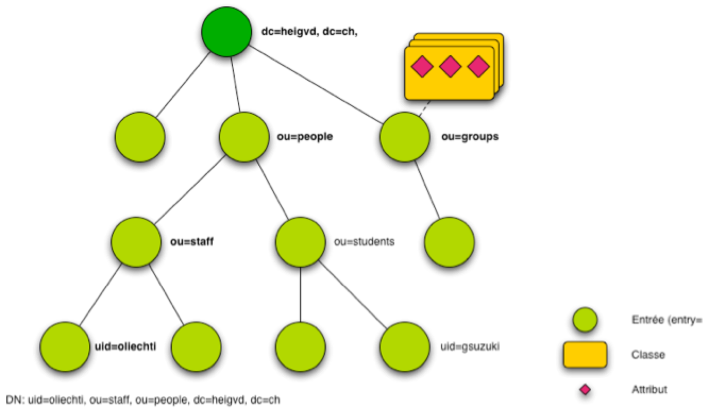
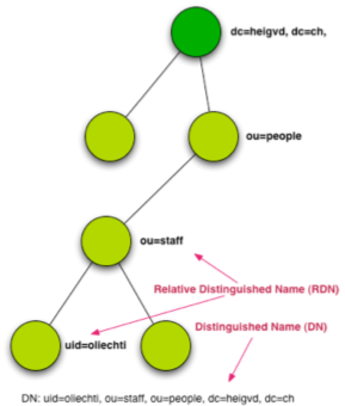
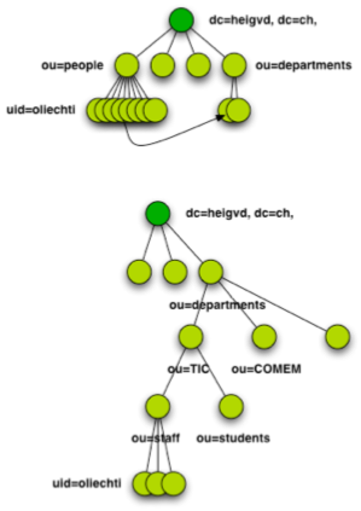
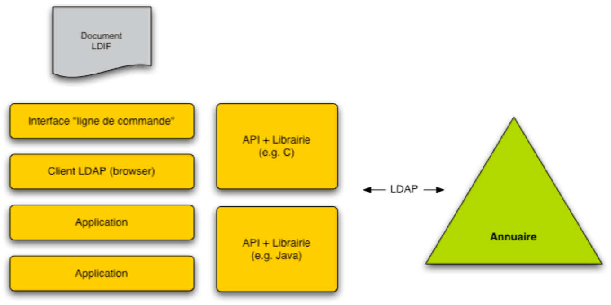
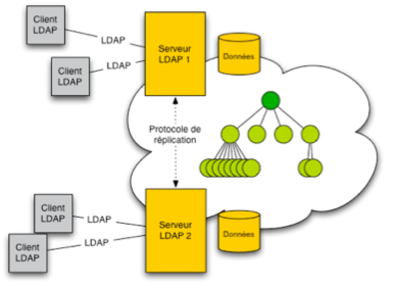

# Lecture 6: LDAP

## Table of Contents

* [Objectives](#Objectives)
* [Lecture](#Lecture)
   * [Objectives](#Objectives)
   * [The LDAP Data Model](#Data Model)
   * [The LDAP Protocol](#Protocol)
   * [Software Components](#Software Components)
   * [Searching for Information in the Directory](#Search)
   * [Importing and Exporting Directory Information](#Exchange)


## <a name="Objectives"></a>Objectives

Almost every company or organization is managing information about users (employees, members, customers, etc.). At the very least, security credentials and contact information are stored in some kind of *identity store*, so that a user can be authenticated when accessing an network service.

The standard approach to manage this type of information is to deploy a server that implements the LDAP protocol (such as Microsoft Active Directory or OpenLDAP). Many applications (messaging applications, business applications, web servers, etc.) can be configured to delegate the authentication of users to a server that *talks LDAP*. Each time that you are prompted your HEIG-VD user id and password, these credentials are verified by the directory service that has been deployed at the School.

As a matter of fact, servers that implement the LDAP protocol can be used to store other types of information as well. For instance, they are often used to manage information about devices (printers, file servers, etc.) or about network services (web service endpoints, etc.).

For all of these reasons, it is important for you to understand the core concepts underlying the LDAP data model and protocol. It is also important to get some practical experience with some LDAP tools, both on the client and on the server side. This is what we will aim to achieve in this part of the course.

Here are the objectives for this lecture:

* Learn how information is **hierarchically organized** in a LDAP server, i.e. become familiar with the notion of **Directory Information Tree** (DIT). Be able to explain what *object classes* and *attributes* are in the context of the LDAP specifications. Understand the role of the *LDAP schema*.

* Be able to describe the key **characteristics** and **operations** defined in the **LDAP protocol**. Be able to explain how LDAP clients can connect with LDAP servers and how they can interact with each other. Learn how to use **LDAP filters to query information** stored in a directory. Learn about **dynamic groups** and how to use them.

* Understand the role of the **LDIF data format**, become familiar with its syntax and learn how to use it to perform **import and export** operations.

* Learn how to use various **software components** that implement the LDAP protocol: a **directory server** (OpenDJ), a **directory browser** (Apache Directory Studio) and **command line tools** (e.g. `ldapsearch`).


## <a name="Lecture"></a>Lecture

### <a name="Data Model"></a>The LDAP Data Model

Unlike in a Relational Database Management System, information is not stored in a tabular format in a directory server. Rather, **it is stored in a hierarchical data structure called the Directory Information Tree (DIT)**.



The **root** of the directory typically represents the organization (such as the HEIG-VD). Every node in the tree has a **type** (i.e. it represents a person, an organizational unit, a device, etc.) and a number of **attributes** (e.g. a name, an phone number, a department number). Every node is uniquely identified by its **Distinguished Name** (DN), which is a string value that also makes it possible to locate it in the tree (see below).



When you decide to use an LDAP server to manage information, **it is up to you to decide how you want to structure your tree**. In other words, it is up to you to decide how many levels you want to use, what kind of information you want to store in the different branches, etc. In the past, there was often a tendency to create deep hierarchies that were reproducing org charts. In these hierarchies, the nodes representing people were scattered under different nodes representing different departments (e.g. there was a *marketing* node, under which people working for the marketing department were placed, there was an *engineering* node, under which engineers were placed, etc). These structures have turned out to lack flexibility and to cause issues (for instance, where should a person be placed if working part-time for the marketing department and part-time for the engineering department?). For this reason, **it is recommended to create LDAP structures that are more flat and to capture relationships that exist between some nodes in relevant attributes**.



As we introduce LDAP concepts, we will provide references to the relevant RFCs. You should be aware tha**t there is not a single RFC that defines all aspects of the LDAP service. In the contrary, there are several distinct RFCs that cover respective topics**. As a starting point, you should have a look at [RFC 4510](http://tools.ietf.org/html/rfc4510), which provides the list of all LDAP-related specifications.

[RFC 4512](http://tools.ietf.org/html/rfc4512)

```
2.1.  The Directory Information Tree

   As noted above, the DIB is composed of a set of entries organized
   hierarchically in a tree structure known as the Directory Information
   Tree (DIT); specifically, a tree where vertices are the entries.

   The arcs between vertices define relations between entries.  If an
   arc exists from X to Y, then the entry at X is the immediate superior
   of Y, and Y is the immediate subordinate of X.  An entry's superiors
   are the entry's immediate superior and its superiors.  An entry's
   subordinates are all of its immediate subordinates and their
   subordinates.

   Similarly, the superior/subordinate relationship between object
   entries can be used to derive a relation between the objects they
   represent.  DIT structure rules can be used to govern relationships
   between objects.

   Note: An entry's immediate superior is also known as the entry's
         parent, and an entry's immediate subordinate is also known as
         the entry's child.  Entries that have the same parent are known
         as siblings.
```


```
2.2.  Structure of an Entry

   An entry consists of a set of attributes that hold information about
   the object that the entry represents.  Some attributes represent user
   information and are called user attributes.  Other attributes
   represent operational and/or administrative information and are
   called operational attributes.

   An attribute is an attribute description (a type and zero or more
   options) with one or more associated values.  An attribute is often
   referred to by its attribute description.  For example, the
   'givenName' attribute is the attribute that consists of the attribute
   description 'givenName' (the 'givenName' attribute type [RFC4519] and
   zero options) and one or more associated values.

   The attribute type governs whether the attribute can have multiple
   values, the syntax and matching rules used to construct and compare
   values of that attribute, and other functions.  Options indicate
   subtypes and other functions.

   Attribute values conform to the defined syntax of the attribute type.
```

```
2.3.1.  Relative Distinguished Names

   Each entry is named relative to its immediate superior.  This
   relative name, known as its Relative Distinguished Name (RDN)
   [X.501], is composed of an unordered set of one or more attribute
   value assertions (AVA) consisting of an attribute description with
   zero options and an attribute value.  These AVAs are chosen to match
   attribute values (each a distinguished value) of the entry.

   An entry's relative distinguished name must be unique among all
   immediate subordinates of the entry's immediate superior (i.e., all
   siblings).
   
2.3.2.  Distinguished Names

   An entry's fully qualified name, known as its Distinguished Name (DN)
   [X.501], is the concatenation of its RDN and its immediate superior's
   DN.  A Distinguished Name unambiguously refers to an entry in the
   tree.  The following are examples of string representations of DNs
   [RFC4514]:

      UID=nobody@example.com,DC=example,DC=com
      CN=John Smith,OU=Sales,O=ACME Limited,L=Moab,ST=Utah,C=US   
```

Like in a Relational Database Management System, it is often desirable to **specify rules and constraints to enforce the consistency of the information stored in the directory**. In particular, it is desirable to specify what kind of entries can be created (i.e. what kind of object classes can be used), what kind of attributes can be added to these entries. These aspects are specified in what is called the **Directory Schema**.

**One thing to be aware of is that when you install an LDAP server, you most often do not start from scratch**. Indeed, most implementations provide you with a **standard schema**. In other words, they provide you with standard classes and attributes that you can use to create your entries. These standard classes and attributes have been specified in RFCs, such as the [RFC 4519](http://tools.ietf.org/html/rfc4519) or the [RFC 2798](http://tools.ietf.org/html/rfc2798).

This is a major difference with relational databases, where there is no notion of standardized *Employee* or *Organization* tables that would always have the same columns. Every DBA needs to define his own relational schema and specify the structure of all its tables. With LDAP, there are RFCs that specify standard LDAP classes and attributes. For this reason, whether you install Microsoft Active Directory or OpenDJ, you will be able to create entries that are instances of the `inetOrgPerson` or of the `organizationalUnit` classes. You will always have the same attributes available for these entries.** This is valuable not only because it allows you to get started quickly, but more importantly because it greatly facilitates the exchange of information between directories**. Indeed, what is exported from the Microsoft Active Directory server deployed in a company A can be easily imported in an OpenDJ server deployed in a company B.

```
4.  Directory Schema

   As defined in [X.501]:

      The Directory Schema is a set of definitions and constraints
      concerning the structure of the DIT, the possible ways entries are
      named, the information that can be held in an entry, the
      attributes used to represent that information and their
      organization into hierarchies to facilitate search and retrieval
      of the information and the ways in which values of attributes may
      be matched in attribute value and matching rule assertions.

      NOTE 1 - The schema enables the Directory system to, for example:

      - prevent the creation of subordinate entries of the wrong
        object-class (e.g., a country as a subordinate of a person);

      - prevent the addition of attribute-types to an entry
        inappropriate to the object-class (e.g., a serial number to a
        person's entry);

      - prevent the addition of an attribute value of a syntax not
        matching that defined for the attribute-type (e.g., a printable
        string to a bit string).
```

```
2.4.  Object Classes

   An object class is "an identified family of objects (or conceivable
   objects) that share certain characteristics" [X.501].
   
   [...]
   
   Each object class identifies the set of attributes required to be
   present in entries belonging to the class and the set of attributes
   allowed to be present in entries belonging to the class.  As an entry
   of a class must meet the requirements of each class it belongs to, it
   can be said that an object class inherits the sets of allowed and
   required attributes from its superclasses.  A subclass can identify
   an attribute allowed by its superclass as being required.  If an
   attribute is a member of both sets, it is required to be present.
   
   [...]
   
   Each object class is identified by an object identifier (OID) and,
   optionally, one or more short names (descriptors).
   
   [...]
   
3.3.  The 'objectClass' attribute

   Each entry in the DIT has an 'objectClass' attribute.

      ( 2.5.4.0 NAME 'objectClass'
        EQUALITY objectIdentifierMatch
        SYNTAX 1.3.6.1.4.1.1466.115.121.1.38 )

   The 'objectIdentifierMatch' matching rule and the OBJECT IDENTIFIER
   (1.3.6.1.4.1.1466.115.121.1.38) syntax are defined in [RFC4517].

   The 'objectClass' attribute specifies the object classes of an entry,
   which (among other things) are used in conjunction with the
   controlling schema to determine the permitted attributes of an entry.
   Values of this attribute can be modified by clients, but the
   'objectClass' attribute cannot be removed.   
```


### <a name="Protocol"></a>The LDAP Protocol

The LDAP protocol is used when a client wants to connect to a directory server and to **perform operations such as authenticating a user, searching for information or updating information**. A client can be a business application, which often uses the information managed in the directory to apply a security policy (e.g. it queries the directory to check if the current user as a given role). A client can also be an administration tool, which is used by an IT staff member to browse through the directory data.

[RFC 4511](http://tools.ietf.org/html/rfc4511)

```
3.  Protocol Model

   The general model adopted by this protocol is one of clients
   performing protocol operations against servers.  In this model, a
   client transmits a protocol request describing the operation to be
   performed to a server.  The server is then responsible for performing
   the necessary operation(s) in the Directory.  Upon completion of an
   operation, the server typically returns a response containing
   appropriate data to the requesting client.

   Protocol operations are generally independent of one another.  Each
   operation is processed as an atomic action, leaving the directory in
   a consistent state.
```


The LDAP protocol is implemented on top of **TCP**, with a standard port defined as **389**. Essentially, the LDAP server listens for connections on this port. Once the client has established a connection, it can send a series of operations. The operations that are understood by the LDAP server are defined in the RFC and are pretty straightforward. Again, they are used to i) authenticate users, ii) search for information and iii) modify information.

```
4.2.  Bind Operation

   The function of the Bind operation is to allow authentication
   information to be exchanged between the client and server.  The Bind
   operation should be thought of as the "authenticate" operation.
   
4.3.  Unbind Operation

   The function of the Unbind operation is to terminate an LDAP session.
   The Unbind operation is not the antithesis of the Bind operation as
   the name implies.  The naming of these operations are historical.
   The Unbind operation should be thought of as the "quit" operation.

4.5.  Search Operation

   The Search operation is used to request a server to return, subject
   to access controls and other restrictions, a set of entries matching
   a complex search criterion.  This can be used to read attributes from
   a single entry, from entries immediately subordinate to a particular
   entry, or from a whole subtree of entries.

4.6.  Modify Operation

   The Modify operation allows a client to request that a modification
   of an entry be performed on its behalf by a server.
   
4.7.  Add Operation

   The Add operation allows a client to request the addition of an entry
   into the Directory.
   
4.8.  Delete Operation

   The Delete operation allows a client to request the removal of an
   entry from the Directory.
   
4.9.  Modify DN Operation

   The Modify DN operation allows a client to change the Relative
   Distinguished Name (RDN) of an entry in the Directory and/or to move
   a subtree of entries to a new location in the Directory. 
   
4.10.  Compare Operation

   The Compare operation allows a client to compare an assertion value
   with the values of a particular attribute in a particular entry in
   the Directory.        
   
```


### <a name="Software Components"></a>Software Components

LDAP is a client-server protocol and as such, you can expect to interact with software components that play these respective roles. But what are LDAP clients exactly? We have already given some examples before. The first thing that you have to be aware of is that there are two main types of clients:

* Firstly, there are clients that an IT administrator is likely to use to browse and update information in the server. In this category, we include both tools with a graphical user interface (such as Apache Directory Studio) and command line tools (such as `ldapsearch` or `ldapmodify`).

* Secondly, there are clients that a *regular* user is likely to use, often without realizing that he is interacting with a LDAP server. In this case, the user is actually using some kind of business application (e.g. an ERP, a collaboration platform, a web service client, etc.). This business application embeds an LDAP module (a library) that connects to a server and issues LDAP commands. The typical example is a web application, where the user can enter credentials in a login form. When the submit button is pushed, the application issues a bind operation to validate the credentials.



Beyond browsers, libraries and servers, **there are other types of components** that implement the LDAP specification. All what we said about **systemic qualities** (performance, scalability, availability, etc.) in the context of the HTTP service also applies to the LDAP service. For this reason, there are also **LDAP proxies and gateways** that can be used to create sophisticated infrastructures to support the LDAP service (which is often critical: just think about what happens when nobody in the company is able to login!). If you want to learn more on that topic, have a look at this [link](http://opendj.forgerock.org/doc/dev-guide/index/chap-simple-proxy.html).

As a matter of fact, the ability to create **distributed architectures for a directory service**, leveraging **replication** capabilities, was a key differentiator with Relational Database Management Systems in the past. Think about a **multinational company** where every employee has his credentials stored in a directory service. If this service was running on top of a centralized infrastructure, every single login would generate a request that traverses the Internet. **This would not be ideal from a response time and cost point of view**, especially in countries and locations with poor network connectivity. With LDAP servers, it is fairly easy to create an infrastructure where all write operations are made on a single server (called the **master**), but where read operations can be made on other servers (called the **slaves**) that can be *nearby*. The servers take care of the data replication, which is thus not a concern for application developers. 



### <a name="Search"></a> Searching for Information in the Directory

When you use a Relational Database Management System, you use SQL to submit **queries** to the database server in order to **fetch records that match certain criteria**. With LDAP, you can do the same, but with a different syntax. The queries that you submit to an LDAP server are called **LDAP filters**.

The OpenDJ documentation provides many examples for filters. You should check this [paragraph](http://opendj.forgerock.org/opendj-server/doc/admin-guide/index/chap-ldap-operations.html#search-ldap) and test the filters and your local installation to become familiar with the syntax.

[RFC 4515](http://tools.ietf.org/html/rfc4515)

```
1.  Introduction

   The Lightweight Directory Access Protocol (LDAP) [RFC4510] defines a
   network representation of a search filter transmitted to an LDAP
   server.  Some applications may find it useful to have a common way of
   representing these search filters in a human-readable form; LDAP URLs
   [RFC4516] are an example of one such application.  This document
   defines a human-readable string format for representing the full
   range of possible LDAP version 3 search filters, including extended
   match filters.
```

```
4. Examples

   This section gives a few examples of search filters written using
   this notation.

        (cn=Babs Jensen)
        (!(cn=Tim Howes))
        (&(objectClass=Person)(|(sn=Jensen)(cn=Babs J*)))
        (o=univ*of*mich*)
        (seeAlso=)
          
```

A feature that is related to searching is the ability to group entries in the directory. OpenDJ supports both **static groups** and **dynamics groups **(as explained [here](http://opendj.forgerock.org/opendj-server/doc/admin-guide/index/chap-groups.html)). The difference is that:

* with static groups, you have to explicitly specify who is a member of a given group. For instance, let us imagine that you have defined a **VIP** group. You would indicate that Bob, John and Barbara are members of the group by explicitly adding a value to the `member` attribute in the VIP group entry.

* with dynamic groups, you specify a condition that is evaluated against candidate entries, by means of an LDAP filter. For instance, you could define a **A-Level Students** dynamic group and specify that all students with a grade above a given threshold should belong to the group (assuming that grades would be stored in the LDAP directory). When requesting the list of members for the group, the server would run a query based on the condition and return the list of qualifying students. Again, make sure to read the OpenDJ documentation and to experiment with dynamic groups on your local installation. 


### <a name="Exchange"></a>Importing and Exporting Directory Information

One task that is very common in real-word settings is the exchange of directory information with other systems. There are numerous examples for this, just think about the following scenarios:

* a legacy business application was using its own user repository (i.e. its user accounts were stored in its own database). At some point, you want to implement a single user repository across the information system and thus need to transfer application accounts toward the central directory server.

* Two companies have merged and you need to integrate their employees contact details in a single directory.

* Your HR application is able to generate an XML or a CSV file for new hires and you job is to create an LDAP entry for every new employee.

* You are asked to provide a contact list (with first name, last name, email and phone) for all employees in the directory.

When facing this type of requirements, you can think of two approaches: 

* Firstly, you can use an LDAP library (possibly implementing a standard API such as the Java Naming and Directory, or [JDNI](http://docs.oracle.com/javase/tutorial/jndi/), in Java) and make calls from an application that you write. In this case, you application becomes an LDAP client and issues requests across the network. For large batch processes, this is not an ideal solution (from a reliability, performance and efficiency point of view).

* The alternative is to use a data format to serialize the information that should go into or out of the directory. The Ldap Data Interchange Format (LDIF) was created exactly for that purpose. LDAP servers are able to import and export LDIF files. Hence, if you are able to produce an LDIF file, you are able to do an import procedure. Similarly, if you are able to parse an LDIF file, you are able to handle an export procedure.

You will see concretely what the second approach means in the lab. You will receive a CSV file containing user data and will have to convert it into a well-formed LDIF file. Once done, you will be able to import it in your local OpenDJ installation, before experimenting wit LDAP filters.


[RFC 2849](http://tools.ietf.org/html/rfc2849)

```
Abstract

   This document describes a file format suitable for describing
   directory information or modifications made to directory information.
   The file format, known as LDIF, for LDAP Data Interchange Format, is
   typically used to import and export directory information between
   LDAP-based directory servers, or to describe a set of changes which
   are to be applied to a directory.

Background and Intended Usage

   There are a number of situations where a common interchange format is
   desirable.  For example, one might wish to export a copy of the
   contents of a directory server to a file, move that file to a
   different machine, and import the contents into a second directory
   server.

   Additionally, by using a well-defined interchange format, development
   of data import tools from legacy systems is facilitated.  A fairly
   simple set of tools written in awk or perl can, for example, convert
   a database of personnel information into an LDIF file. This file can
   then be imported into a directory server, regardless of the internal
   database representation the target directory server uses.

   The LDIF format was originally developed and used in the University
   of Michigan LDAP implementation.  The first use of LDIF was in
   describing directory entries.  Later, the format was expanded to
   allow representation of changes to directory entries.
   
   [...]
   
   Definition of the LDAP Data Interchange Format

   The LDIF format is used to convey directory information, or a
   description of a set of changes made to directory entries.  An LDIF
   file consists of a series of records separated by line separators.  A
   record consists of a sequence of lines describing a directory entry,
   or a sequence of lines describing a set of changes to a directory
   entry.  An LDIF file specifies a set of directory entries, or a set
   of changes to be applied to directory entries, but not both.

   There is a one-to-one correlation between LDAP operations that modify
   the directory (add, delete, modify, and modrdn), and the types of
   changerecords described below ("add", "delete", "modify", and
   "modrdn" or "moddn").  This correspondence is intentional, and
   permits a straightforward translation from LDIF changerecords to
   protocol operations.
```

```
Example 1: An simple LDAP file with two entries

version: 1
dn: cn=Barbara Jensen, ou=Product Development, dc=airius, dc=com
objectclass: top
objectclass: person
objectclass: organizationalPerson
cn: Barbara Jensen
cn: Barbara J Jensen
cn: Babs Jensen
sn: Jensen
uid: bjensen
telephonenumber: +1 408 555 1212
description: A big sailing fan.

dn: cn=Bjorn Jensen, ou=Accounting, dc=airius, dc=com
objectclass: top
objectclass: person
objectclass: organizationalPerson
cn: Bjorn Jensen
sn: Jensen
telephonenumber: +1 408 555 1212
```

```
Example 6: A file containing a series of change records and comments

version: 1
# Add a new entry
dn: cn=Fiona Jensen, ou=Marketing, dc=airius, dc=com
changetype: add
objectclass: top
objectclass: person
objectclass: organizationalPerson
cn: Fiona Jensen
sn: Jensen
uid: fiona
telephonenumber: +1 408 555 1212
jpegphoto:< file:///usr/local/directory/photos/fiona.jpg

# Delete an existing entry
dn: cn=Robert Jensen, ou=Marketing, dc=airius, dc=com
changetype: delete

# Modify an entry's relative distinguished name
dn: cn=Paul Jensen, ou=Product Development, dc=airius, dc=com
changetype: modrdn
newrdn: cn=Paula Jensen
deleteoldrdn: 1

# Rename an entry and move all of its children to a new location in
# the directory tree (only implemented by LDAPv3 servers).
dn: ou=PD Accountants, ou=Product Development, dc=airius, dc=com
changetype: modrdn
newrdn: ou=Product Development Accountants
deleteoldrdn: 0
newsuperior: ou=Accounting, dc=airius, dc=com
# Modify an entry: add an additional value to the postaladdress
# attribute, completely delete the description attribute, replace
# the telephonenumber attribute with two values, and delete a specific
# value from the facsimiletelephonenumber attribute
dn: cn=Paula Jensen, ou=Product Development, dc=airius, dc=com
changetype: modify
add: postaladdress
postaladdress: 123 Anystreet $ Sunnyvale, CA $ 94086
-

delete: description
-
replace: telephonenumber
telephonenumber: +1 408 555 1234
telephonenumber: +1 408 555 5678
-
delete: facsimiletelephonenumber
facsimiletelephonenumber: +1 408 555 9876
-

# Modify an entry: replace the postaladdress attribute with an empty
# set of values (which will cause the attribute to be removed), and
# delete the entire description attribute. Note that the first will
# always succeed, while the second will only succeed if at least
# one value for the description attribute is present.
dn: cn=Ingrid Jensen, ou=Product Support, dc=airius, dc=com
changetype: modify
replace: postaladdress
-
delete: description
-
```


